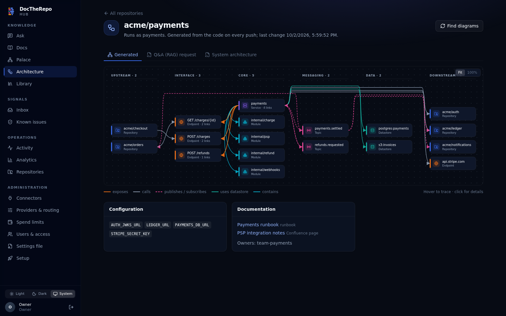
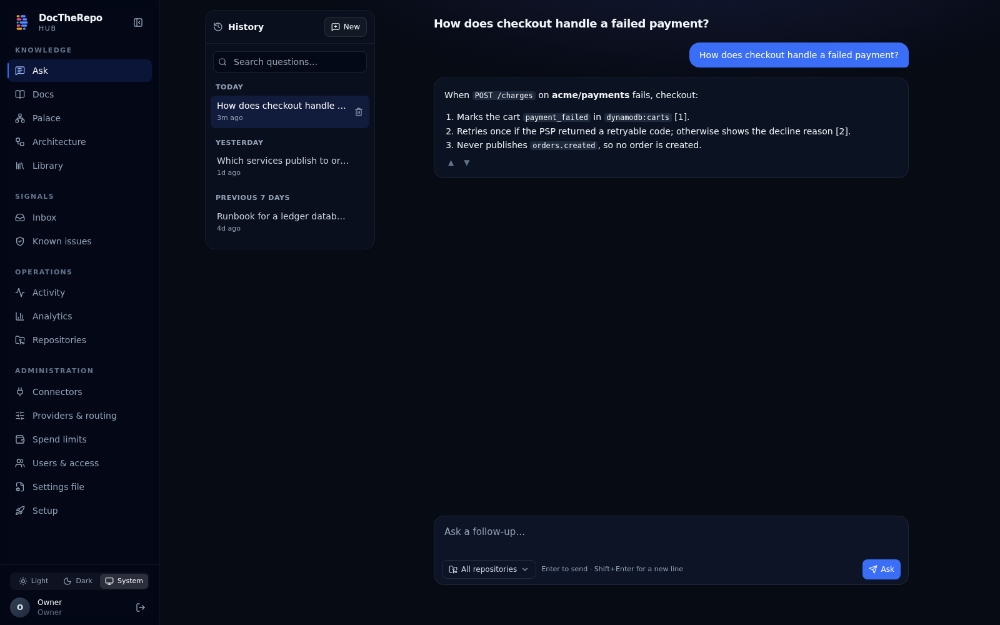
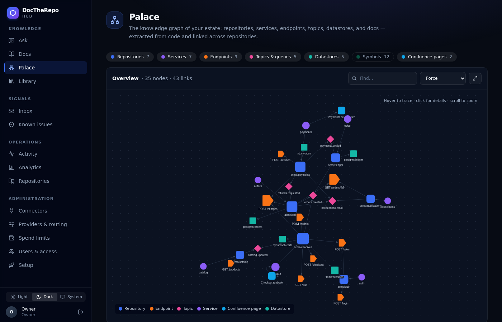

<p align="center">
  
</p>

<h1 align="center">DocTheRepo Hub</h1>

<p align="center">
  Living documentation, answers and error intelligence for every repository: self-hosted, with your own model keys.
</p>

<p align="center">
  <a href="LICENSE"></a>
  
  
</p>

---

DocTheRepo Hub watches your repositories. On every push it writes and updates documentation where the code
changed. It answers questions about your systems with citations, maps how services, endpoints, topics and
datastores connect, and explains the errors and alerts your tools report.

It runs in your infrastructure: one Go binary, PostgreSQL, and the LLM provider accounts you already have
(Claude, OpenAI, Azure OpenAI, Bedrock, Vertex, GitHub Models, Ollama, opencode or any OpenAI-compatible server). Hard spend limits
are checked before every paid call.

<p align="center">
  
</p>

## Features

| | |
|---|---|
| **Docs that keep up** | Each push is triaged by syntax tree: cosmetic changes cost nothing, and structural ones regenerate only the affected sections. Docs land directly, as an auto-merged PR, or as a PR for an approver. Hand-written blocks survive regeneration. |
| **Ask** | Hybrid retrieval (vectors + full text + the knowledge graph) over code, docs, Confluence and Jira, scoped to what the person may read. When search finds too little, the model looks further (searches again, reads files) before answering. Answers stream with citations, repeated questions come from a cache, and history is kept per user. |
| **Palace & Architecture** | A knowledge graph extracted from code: repositories, services, endpoints, topics, datastores, docs. Every repository gets a generated architecture diagram; diagrams authored with [archify](https://github.com/tt-a1i/archify) appear next to it. |
| **Inbox** | Sentry, Datadog, PagerDuty, Opsgenie, Grafana, Alertmanager, CloudWatch, GCP, Wiz, Splunk, Kafka/SQS/Pub/Sub/RabbitMQ lag and DLQs. Signals are scrubbed, grouped, matched against known issues and explained with the code behind them. Any source can be marked never-send-to-a-model. |
| **Connect in one click** | **Connect with GitHub** creates a private GitHub App for the Hub and installs it on the repositories you pick, with nothing to copy. GitLab and tokens work too. |
| **Sealed secrets** | Provider keys and credentials are sealed in the browser to the Hub's hybrid X25519 + ML-KEM-768 key, stored with AES-256-GCM under a local or KMS key, and are write-only. |
| **Settings as code** | Configure sign-in and SSO, users, providers, routing, connectors, repositories and limits from YAML/JSON, with secrets as references to env, files, Vault, gopass, AWS or GCP secret managers. Apply it with `dth apply -f`, or let the Hub apply it at startup so a deployment comes up ready. |
| **Built to run** | Roles (api, worker, scheduler) scale independently. Ships with a Postgres job queue, Prometheus metrics, OIDC, RBAC and per-repository access, an audit log, Helm, Terraform for AWS/GCP, CycloneDX SBOMs, and vulnerability gates in CI. |

<p align="center">
  
  
</p>

## Quick start

One command checks and installs what is missing (Go, Node.js, Docker), builds the Hub, starts PostgreSQL,
creates the owner account and opens the UI:

```sh
git clone https://github.com/GokulMV/DocTheRepo && cd DocTheRepo
./scripts/quickstart.sh
```

To get the latest version later:

```sh
cd DocTheRepo && git pull && ./scripts/quickstart.sh
```

Optionally set `ANTHROPIC_API_KEY` and/or `OPENAI_API_KEY` first to configure models automatically. No
password is printed or saved: the first run opens a one-time link where you choose the owner password
(`./scripts/quickstart.sh --reset-password` makes a new one). Stop with `./scripts/quickstart.sh --down`.

Re-running the quickstart (for example after `git pull`) keeps everything: connectors, the GitHub App,
provider keys, routing, repositories and docs live in the database and `~/.dth-quickstart` (which holds the
master key that encrypts your keys; back it up). It never overwrites routing you changed in the UI. Only
`--down --wipe` deletes data.

Then, in the UI:
1. **Connectors → Connect with GitHub**, and pick repositories.
2. **Providers & routing:** add your model provider.
3. **Ask** away.

More ways to run it, from Docker Compose with `dth up` to Kubernetes (Helm) and AWS/GCP (Terraform), are in
[docs/install.md](docs/install.md).

## Deploying for your team

### How a deployment works

```
                 HTTPS                        ┌──────────────── the Hub (one image) ─────────────────┐
  people ───────────────────▶ load balancer ─▶│ api (UI + REST + webhooks, 2+)                         │
  GitHub/GitLab webhooks ───▶   (TLS)         │ worker (docs, indexing, error explanations, 1+)        │
                                              │ scheduler (polling, cleanup; exactly 1)                │
                                              └───────┬──────────────────────────────┬────────────────┘
                                                      │                              │ outbound HTTPS
                                          PostgreSQL 16 + pgvector       your git host · your model provider
                                          (all state, job queue)         your identity provider (SSO)
                                                                         optional: Sentry, Datadog, Jira, …
```

- **One image, three roles.** All state lives in PostgreSQL, so api and worker replicas scale freely.
- **Secrets at rest.** Stored keys and tokens are encrypted with a master key: a local key file, AWS KMS
  or Google Cloud KMS.
- **On every start** the Hub:
  1. migrates the database;
  2. creates the owner from `DTH_OWNER_EMAIL` if no users exist yet;
  3. applies your **settings file**: sign-in and SSO, owners and users, model providers, connectors and
     repositories.

So a new deployment is ready the moment it starts: people sign in with SSO, the owners are owners, and
docs start generating, before anyone clicks anything.

### Before you deploy: answer the questions once

```sh
make build                 # or use a dth release binary
./bin/dth init             # writes hub.yaml and prints your checklist
```

`dth init` asks:
1. where the Hub runs (your computer, a Compose server, AWS, Google Cloud, Kubernetes);
2. its address;
3. how people sign in (single sign-on with Google Workspace, Microsoft Entra ID, Okta, Keycloak or any
   OpenID Connect provider, and/or passwords);
4. who the owners are;
5. which model provider to use;
6. where your code is.

For SSO it shows the steps to create the app at your identity provider and the callback URL to register
there. It never asks for secrets: the file refers to environment variables (`DTH_SECRET_…`) that you set
where the Hub runs. It then prints the prerequisites for your target, the secrets to set, and the exact
deploy command. Owners can change any of this later in the UI (**Sign-in & SSO**, **Users & access**,
**Providers & routing**).

### Prerequisites

| | Needed for every team deployment |
|---|---|
| A domain and HTTPS | e.g. `https://docs-hub.acme.com`. SSO providers and GitHub webhooks require https. |
| An identity provider app (for SSO) | A web OpenID Connect app with the callback `https://<your domain>/api/v1/auth/callback`. `dth init` and **Sign-in & SSO** show the steps per provider. Without SSO, people sign in with passwords you send them links for. |
| A model provider | An API key (Anthropic, OpenAI, Azure OpenAI), a GitHub token for GitHub Models, cloud access (Bedrock, Vertex), an Ollama server, or opencode for docs. You pay the provider directly; spend limits are enforced before every call. |
| Access to your code | Rights to install a GitHub App on your organization (one click in the Hub), or a GitHub/GitLab token. |
| Network | Outbound HTTPS to the git host, model provider and identity provider. Inbound HTTPS from the git host for webhooks (otherwise the Hub polls every minute). |

| Target | Also needed |
|---|---|
| Your computer (quickstart) | macOS or Linux (Windows: WSL 2), 4 GB free memory. The script installs Docker, Go and Node.js if missing. |
| A server (Docker Compose) | Linux with Docker and Compose v2; 2 vCPU, 4 GB RAM, 20 GB disk; a reverse proxy with TLS in front of port 8080. |
| AWS (Terraform) | Terraform 1.6+; a VPC with two public and two private subnets (NAT); an ACM certificate; rights for ECS, RDS, ALB, KMS, Secrets Manager and IAM. |
| Google Cloud (Terraform) | Terraform 1.6+; a project with billing; the image mirrored to Artifact Registry; a domain for the load balancer IP; rights for Cloud Run, Cloud SQL, KMS and Secret Manager. |
| Kubernetes (Helm) | Kubernetes 1.27+, Helm 3; PostgreSQL 16 with pgvector; an Ingress with TLS; AWS KMS or Cloud KMS through workload identity, or a shared master-key Secret. |

### Deploy with the settings file

| Target | Command |
|---|---|
| Your computer | `./scripts/quickstart.sh --settings hub.yaml` (or `--init` to answer the questions there) |
| Docker Compose | put `hub.yaml` in `./settings/` next to `deploy/compose/docker-compose.yml`, secrets in `.env`, then `docker compose up -d` |
| AWS / Google Cloud | `terraform apply -var "hub_settings=$(dth settings resolve -f hub.yaml)"` (stored in Secrets Manager / Secret Manager) |
| Kubernetes | store `dth settings resolve -f hub.yaml` as a Secret and `helm install … --set settings.existingSecret=<it>` |

Step-by-step guides: [docs/install.md](docs/install.md). Sign-in details: [docs/users-and-sign-in.md](docs/users-and-sign-in.md). Running it day to day (backups, upgrades, alerts): [docs/operations.md](docs/operations.md).

## Documentation

| Topic | |
|---|---|
| Install & deploy | [docs/install.md](docs/install.md) |
| Users, roles, sign-in and SSO | [docs/users-and-sign-in.md](docs/users-and-sign-in.md) |
| Operations: backups, upgrades, monitoring | [docs/operations.md](docs/operations.md) |
| Nonlive and production: pipeline, logins, switching | [docs/environments.md](docs/environments.md) |
| Team documents: Notion and uploaded files | [docs/team-docs.md](docs/team-docs.md) |
| Security scans (kryptonite) and fixes on request | [docs/security-scans.md](docs/security-scans.md) |
| How docs are generated, and `.dthignore` | [docs/docs-generation.md](docs/docs-generation.md) |
| Architecture | [docs/architecture.md](docs/architecture.md) · [diagrams](docs/architecture/) |
| Connecting GitHub | [docs/github.md](docs/github.md) |
| Every connector: git hosts, Confluence/Jira, error and alert sources | [docs/connectors.md](docs/connectors.md) |
| Settings file (YAML/JSON, secret references) | [docs/settings-file.md](docs/settings-file.md) |
| Architecture tab | [docs/architecture-tab.md](docs/architecture-tab.md) |
| Confluence & Jira · Wiz & Splunk · Jev | [confluence-jira](docs/confluence-jira.md) · [wiz-splunk](docs/wiz-splunk.md) · [jev](docs/jev.md) |
| opencode, Claude Code, Cursor (MCP) | [docs/opencode.md](docs/opencode.md) |
| Security model & sealed secrets | [docs/security.md](docs/security.md) |
| Performance results | [docs/perf-results.md](docs/perf-results.md) |
| What is built, phase by phase | [docs/status.md](docs/status.md) |
| Development | [docs/development.md](docs/development.md) |
| Brand & logo | [docs/brand/](docs/brand/) |

## Contributing

Bug reports, ideas and pull requests are welcome. See [CONTRIBUTING.md](CONTRIBUTING.md). Please follow the
[Code of Conduct](CODE_OF_CONDUCT.md), and report security issues privately as described in
[SECURITY.md](SECURITY.md).

## License

[MIT](LICENSE) © 2026 GokulMV. Third-party components and their licenses are listed in
[THIRD_PARTY_LICENSES.md](THIRD_PARTY_LICENSES.md).
