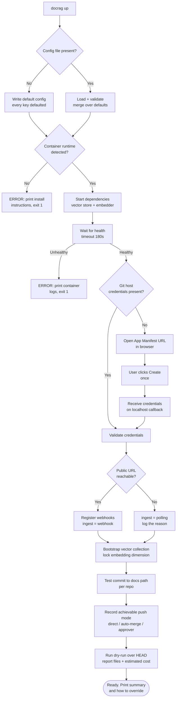
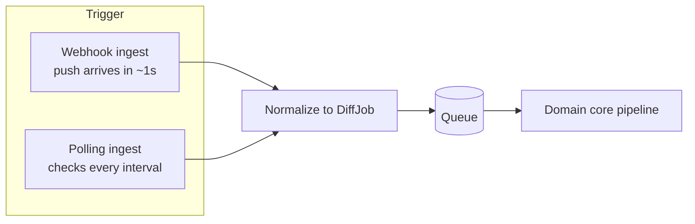
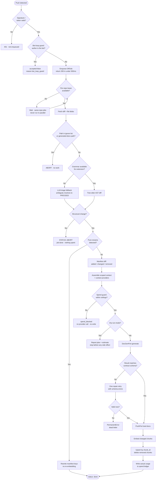
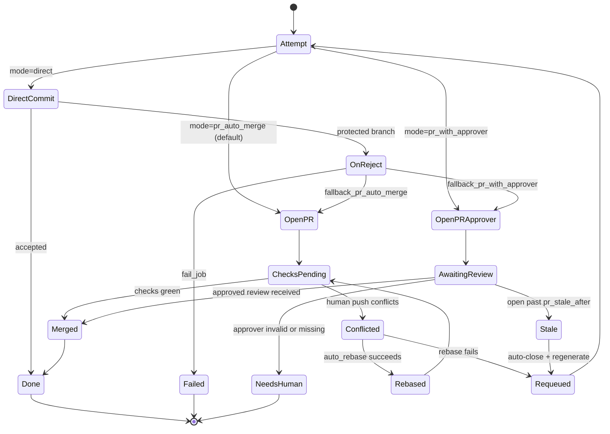
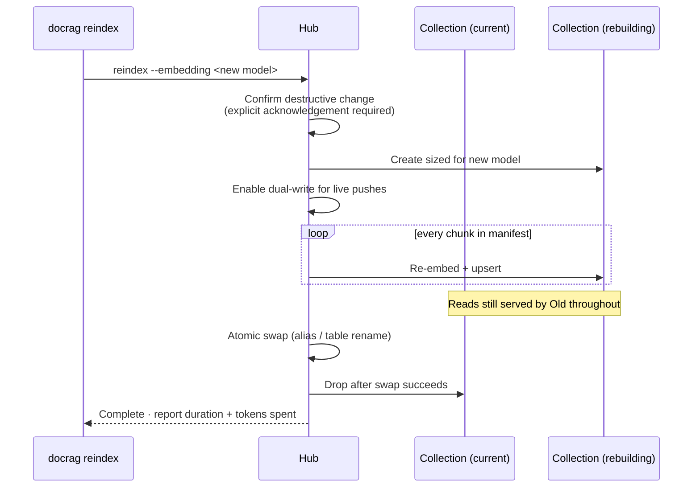

# Plan: DocRAG Orchestrator

## 1. Project Overview

DocRAG Orchestrator is a self-hosted, config-driven service that keeps generated documentation and a
semantic (RAG) vector index in sync with code changes across an arbitrary number of repositories on
GitHub or GitLab. It listens to `push` webhooks, uses a structural (AST-level) diff to distinguish real
architectural changes from cosmetic noise, generates or updates Markdown documentation for real changes
through a pluggable doc-generation engine, lands that documentation in an agent-owned path in each repo,
and re-indexes the affected content into a vector database — so engineers and AI agents can ask questions
across the whole estate ("how does auth work across the platform?") and get accurate, current answers. It
exists because commit messages are unreliable, AI-agent context windows are expensive, and a stale RAG
index silently produces hallucinated answers about code that no longer exists. It ships as an installable
tool — not a hosted SaaS — deployed by any team into their own environment via a CLI installer, a Helm
chart, or a Terraform module, with every major backend (git host, vector DB, embedding model,
doc-generation engine, job queue, push strategy) swappable through one config file, and with zero
hardcoded dependency on any single AI coding-agent product. Because it spends money on the operator's own
LLM account autonomously, cost ceilings and a dry-run mode are first-class features, not afterthoughts.

## 2. Goals & Non-Goals

### Goals
1. Ingest a `push` webhook from any of n configured repositories on GitHub or GitLab (including
   self-managed GitLab) and, using AST-level diffing (Tree-sitter), classify the change as cosmetic
   (`STATUS: ABORT`, no further processing) or structurally significant (`STATUS: PROCEED`) — new classes,
   methods, endpoints, env vars, or architectural shifts.
2. For structurally significant changes, generate updated Markdown documentation and land it under a
   configurable agent-owned path (default `docs/generated/`, settable per repo to match Docusaurus,
   MkDocs, monorepo, or in-house conventions), via direct commit, MR/PR+auto-merge, or MR/PR+approver, per
   a configured push mode — and never touch any path outside that subtree.
3. Chunk source code (by AST node — function/method/class) and documentation (by heading section), and
   upsert the resulting embeddings tagged with `repo`, `language`, `path`, and `commit_sha`, under a
   configurable isolation mode: `pooled` (one shared collection, cross-repo search) or `per_repo`
   (one collection per repo, hard isolation for compliance, client separation, or contractor access).
4. Detect and remove stale vector chunks when a symbol or doc section is deleted or reverted, so the index
   never serves content that no longer exists in the source repos.
5. Support a one-time bulk import of a repo's pre-existing on-disk Markdown documentation (including a
   cloned wiki, which is itself a git repo) at install time, so the vector index is populated
   before the first live push arrives, with imported chunks deterministically superseded by generated
   ones on collision.
6. Let the installing team choose — via one YAML config file, with no code changes — the git host, the
   vector DB backend, the embedding model, the doc-generation strategy (direct LLM API call vs. external
   headless agent CLI), the job queue backend, the isolation mode, and the push mode. Every one of these
   ports ships with at least two working adapters, so pluggability is proven rather than assumed.
7. Let the team inject additional context into doc generation from any external tool they already
   run (a code knowledge graph, a symbol indexer, an internal context service) by configuring a command
   that emits context to stdout — with no tool-specific parsing code in the Hub.
8. Enforce operator-defined spend ceilings (per-day and per-job token/cost caps) with a hard stop when
   breached, and provide a `--dry-run` mode that performs full triage and reports exactly what *would* be
   generated and at what estimated cost, without calling a paid provider or writing to any repo.
9. Ship Tree-sitter grammars for Go, Java, Python, TypeScript/JavaScript, and Rust in the binary, plus
   runtime loading of additional grammars from a configured directory — so language coverage grows without
   a Hub release or an unbounded binary.
10. Ship as a single Go binary with two entry points (a long-running Hub service and a one-shot CLI
    installer), distributed via a container image with a Helm chart for Kubernetes and a Terraform module
    for VM/Compose targets — all three provisioning the same image.
11. Scale from as few as 2 repos to 30+ without any architectural change — only config additions.
12. Install and run the entire stack with **one command and no config file**: `docrag up` detects the
    container runtime, starts the Hub and every dependency it needs, writes a complete default config,
    obtains git-host credentials through a one-click browser authorization, verifies every component, and
    finishes with a dry-run preview. Every configuration key has a working default; a config file is an
    override mechanism, never a prerequisite.
13. Ingest changes with or without a publicly reachable URL: webhook ingest when the Hub is reachable,
    automatic fallback to polling ingest when it is not, with identical downstream processing.

### Non-Goals

These are permanent scope boundaries, not deferrals. There is no later release to move them into: the
project ships as one Go module producing one binary, built to completion in a single pass. Anything not
excluded here is in scope and gets implemented.

- Bitbucket, Gitea, Azure DevOps, and other git hosts. GitHub and GitLab are implemented; `GitHostPort`
  plus the adapter parity suite (§ 10) makes any further host additive work for whoever needs it, but the
  project does not ship or maintain those adapters.
- A hosted/managed multi-tenant version of the Hub — self-hosted only.
- Editing, reviewing, or reading human-authored documentation outside the configured generated-docs path.
- Real-time/streaming updates — the Hub reacts to webhook pushes only.
- A web UI/dashboard. The interface is the API, the CLI, structured logs, and Prometheus metrics.
  Infrastructure tooling of this kind is operated through existing dashboards, not its own; building one
  would be a larger surface than the Hub itself and would need its own auth, sessions, and release cycle.
- Training or fine-tuning an embedding model or LLM — the Hub only calls existing providers/tools.
- Non-GitHub-App bypass configuration — the Hub can detect and recommend branch-protection changes but
  cannot apply them itself (requires org admin action; see § 15).
- Shell-output token-compression wrappers (RTK and equivalents). Removed on evidence: JetBrains' paired
  A/B benchmark measured rtk at **+7.6% tokens** against an advertised 60–90% saving, and the Caveman
  skill at **−8.5%** against an advertised −65%. The Hub reduces tokens through scoped AST context
  instead (§ 8), which is measurable and under the Hub's own control.
- Parsing any third-party tool's on-disk data format (including Graphify's graph output). Such formats
  are not stable contracts; external context enters only via the generic `ContextProviderPort` (§ 5).
- Non-Markdown documentation import (Confluence exports, DOCX, proprietary wiki dumps). The importer
  reads Markdown from disk only; converting arbitrary document formats is a different problem with a
  different failure mode, and `pandoc` already solves it upstream of this tool.
- Multi-node / horizontally scaled Hub deployment. The NATS JetStream adapter makes a clustered queue
  possible, but correct multi-node operation also requires distributed lease semantics, leader election
  for the GC and staleness sweeps, and split-brain handling — a materially different system. One Hub
  process comfortably serves the stated scale; running two is unsupported and unsafe.
- Bundling every Tree-sitter grammar. Five are compiled in (§ 2 Goals); anything else is loaded at runtime
  from a configured grammar directory. An unbounded binary serves nobody.
- A community adapter registry or marketplace. Adapters are configured by explicit command path; building
  discovery infrastructure before adapters exist to discover is premature (§ 15).
- Automatic provider cost discovery. The Hub enforces the ceilings the operator sets; it does not attempt
  to read billing APIs or infer plan limits (§ 8).

## 3. Technology Stack

| Layer | Technology | Why chosen |
|---|---|---|
| Language | Go 1.23 | Required by you — single static binary for both the Hub and the CLI installer, minimal runtime dependency footprint for a self-hosted tool with a restricted target environment |
| HTTP framework | `net/http` + `chi` router | Standard-library-first; `chi` adds only routing/middleware sugar without a heavy framework |
| Job queue (default adapter) | In-process worker pool (Go channels) backed by `bbolt` | Zero extra services to install — correct default for a restricted, self-hosted target environment |
| Job queue (durability adapter) | Embedded NATS JetStream (`nats-server` as a Go library) | Ships inside the same binary. Chosen for stream replay, consumer-lag visibility, and message-level observability that `bbolt` cannot provide — **not** for horizontal scale-out, which remains unsupported (§ 2). Calling it a scale-out adapter while forbidding multi-node would be a contradiction; this is what it is actually for |
| AST diffing | Tree-sitter via `go-tree-sitter` bindings | Language-agnostic per your original requirement; avoids per-language custom parsers |
| Vector DB (adapter 1) | Qdrant | Payload filtering fits the repo/language/path metadata model; lightweight self-hosted footprint; official Go client via gRPC; collection aliases enable zero-downtime reindex (§ 8) |
| Vector DB (adapter 2) | PostgreSQL + pgvector | Second implementation proves the port is a real abstraction; many target orgs already run Postgres, so it removes a new-service install entirely |
| Embedding (reference adapters) | Ollama (local) and an OpenAI-compatible HTTP adapter (cloud) | Covers both ends of the pluggability requirement with minimal adapter code — both speak simple HTTP |
| Config format | YAML (`gopkg.in/yaml.v3`) | Human-editable; usable by both the CLI wizard and Terraform templating |
| CLI framework | Cobra | De facto Go standard for multi-command CLIs (kubectl, gh, docker) — familiar UX for the target audience |
| Infra-as-code | Terraform module (HCL) wrapping the Docker provider | For teams deploying to VMs rather than Kubernetes; targets the same container image the Helm chart and Compose file use |
| Containerization | Docker + Docker Compose | The container image is the single build artifact all three deployment paths (Compose, Helm, Terraform) consume, so what is tested is what ships |
| Git API client (GitHub) | `google/go-github` | Canonical, actively maintained Go GitHub client with full REST + GitHub App auth support |
| Git API client (GitLab) | `gitlab.com/gitlab-org/api/client-go` | Official Go client; supports gitlab.com and self-managed instances with the same API surface, which is where most restricted-environment teams actually are |
| Tree-sitter grammars | 5 compiled in (Go, Java, Python, TS/JS, Rust) + runtime `.so`/`.wasm` loading from a configured directory | Covers the majority of real repos out of the box without an unbounded binary; anything else is added without waiting for a Hub release |
| Kubernetes packaging | Helm chart (single-replica StatefulSet, with a hard replica guard) | Most teams that run services run them on Kubernetes. The chart **fails rendering** if `replicaCount > 1`, because the Hub is single-node by design (§ 2) and a silently-accepted `replicas: 3` would corrupt `bbolt` state. When the chart is installed with the Postgres-backed profile, state lives outside the pod and the StatefulSet becomes a Deployment |
| Structured logging | `log/slog` (stdlib) | Go 1.21+ stdlib structured logging — no extra dependency |
| Unit testing | `testing` + `testify` | Standard Go testing idiom, table-driven tests, clear assertions |
| Integration testing | `testcontainers-go` | Spins up real Qdrant (and a mock GitHub server) in CI — no faked backend behavior |
| Performance testing | k6 + a stub doc-gen adapter with configurable latency | Webhook ingestion was never the bottleneck — doc generation is, and it is LLM-latency-bound. The stub lets the burst-drain target in § 10 be measured deterministically without burning provider quota |
| E2E testing | Playwright (driving the CLI's interactive prompts via a pty harness) | Verifies the full install → first push → doc appears → vector searchable path end to end |
| Dependency security | `govulncheck` | Official Go vulnerability scanner, CI-gateable |

## 4. Architecture

**Pattern**: Hexagonal Architecture (Ports & Adapters) with an async event-driven core.

**Why this pattern**: The core requirement — swap the vector DB, embedding model, doc-generation engine,
and git-push strategy via config alone, with no code changes — is exactly what ports & adapters is built
for: the domain core depends only on interfaces, and each swappable backend is an adapter implementing one
of those interfaces. The webhook → triage → generate → index flow is inherently asynchronous (GitHub
expects a sub-10-second webhook response; real processing takes far longer), so an event-driven core
(webhook enqueues a job, workers consume it) is layered inside the hexagon rather than treated as a
separate pattern — this is the "Hexagonal + Event-Driven" hybrid.

**Component diagram**:
```
                          ┌───────────────────────────────┐
GitHub Webhook  ───POST──▶│  Input Adapter: HTTP Handler    │
 (push event)             │  (verify signature, bot-loop    │
                          │   guard, enqueue Job, return 200)│
                          └────────────────┬────────────────┘
                                           │ enqueue
                                           ▼
                          ┌───────────────────────────────┐
                          │  QueuePort                       │
                          │  Adapters: bbolt (default),        │
                          │            natsjetstream            │
                          └────────────────┬────────────────┘
                                           │ dequeue (per-repo serialized)
                                           ▼
                          ┌───────────────────────────────┐
                          │          Domain Core             │
                          │  1. Bot-loop / path guard         │
                          │  2. AST Diff (tree-sitter)         │
                          │  3. Triage Gate (ABORT/PROCEED)     │
                          │  4. Chunk Manifest Diff              │
                          │  5. Scoped-context assembly           │
                          │  6. Spend guard (hard stop)            │
                          └──┬────────┬────────┬────────┬─────┘
                     (port)  │        │        │        │  (port)
       ┌────────────────────┘        │        │        └──────────────────┐
       ▼                             ▼        ▼                           ▼
┌──────────────────┐   ┌──────────────────┐  ┌──────────────────┐  ┌──────────────────┐
│ GitHostPort        │   │ ContextProvider   │  │ DocGenPort        │  │ EmbeddingPort     │
│ Adapters: github,   │   │ Port               │  │ Adapters:          │  │ Adapters: ollama,  │
│ gitlab               │   │ Adapter: command   │  │ directapi,          │  │ openaicompat        │
│                       │   │ (stdout capture)   │  │ externalcli         │  │                      │
└─────────┬────────────┘   └──────────────────┘  └─────────┬────────┘  └─────────┬────────┘
          │                                                  │                     │
          ▼                                                  │                     ▼
┌──────────────────┐                                         │        ┌──────────────────┐
│ PushPort            │◀──────────────────────────────────────┘        │ VectorStorePort    │
│ Adapters: direct,    │                                                │ Adapters: qdrant,   │
│ prautomerge,          │                                                │ pgvector             │
│ prapprover             │                                                └─────────┬────────┘
└──────────────────┘                                                              │
                                                                                    ▼
                                                                       ┌──────────────────┐
                                                                       │ ManifestStorePort  │
                                                                       │ Adapter: bbolt      │
                                                                       └──────────────────┘
```

### Bootstrap flow — what `docrag up` actually does



Every step is idempotent: re-running `docrag up` re-verifies rather than re-creates, so it doubles as a
health check and an upgrade path. Any failure prints the failing step, the reason, and the one command
that fixes it — never a stack trace as the primary output.

### Ingest selection — why there are two triggers



Both adapters produce the identical `DiffJob`, so nothing downstream knows or cares which fired. Polling
compares each repo's branch head SHA against the last processed SHA in the manifest store; on a
difference it constructs the same job a webhook would have. This is what allows a laptop, an air-gapped
runner, or a Hub behind NAT to work with no tunnel, no reverse proxy, and no public DNS.

**Data flow (primary path)**:
1. The configured git host sends a `push` webhook to `POST /webhooks/{provider}`.
2. The HTTP adapter verifies the HMAC signature, checks the pusher/committer identity against the Hub's
   own bot identity (bot-loop guard — reject immediately if this push was authored by the bot itself, and
   ignore any changed path under the configured generated-docs path in the diff scope), enqueues a `DiffJob` with repo,
   before/after SHAs, and changed-file list, then returns `200 OK`.
3. A worker dequeues the job, fetches the raw diff, and builds a Tree-sitter AST diff per changed file.
4. The Triage Gate classifies the AST diff. Cosmetic-only changes short-circuit with `STATUS: ABORT`;
   the job is marked done and logged with no further work.
5. On `STATUS: PROCEED`, the core diffs the new AST/doc structure against the stored chunk manifest to
   compute added / changed / removed chunks.
6. The core checks the **spend guard** (§ 8) before any paid call. If the estimated cost of this job would
   breach the per-job or per-day ceiling, the job is marked `spend_blocked` and stops here — no provider
   call, no repo write. In `--dry-run` mode the pipeline also stops here and reports what would have been
   generated and at what estimated cost.
7. The core assembles a **scoped context** (§ 8) — only the changed symbols plus their immediate callers
   and callees, never whole files — and appends any output from a configured `ContextProviderPort`
   command. The configured DocGenPort adapter is invoked with that scoped context, the AST summary, and
   the list of chunks needing (re)generation; it returns generated Markdown plus per-chunk metadata,
   validated against the contract schema with one repair-retry before failure.
7. The configured PushPort adapter lands the generated docs per the configured push mode, with the
   reject-and-fallback behavior defined in § 8.
8. The configured EmbeddingPort adapter embeds each new/changed chunk; the configured VectorStorePort
   adapter upserts by stable chunk ID and issues explicit deletes for removed chunks.
9. The job is marked complete. Every step is logged with a correlation ID so any failure is traceable back
   to the originating webhook delivery.

### Job lifecycle — every gate from trigger to indexed



The two gates that stop work before money is spent — triage and the spend guard — are deliberately the
cheapest steps in the chain. A cosmetic push costs one AST parse and nothing else.

### Push-mode decision and PR lifecycle



No state in this diagram is terminal-by-neglect: every path either completes, requeues against current
code, or is explicitly surfaced as needing a human. An abandoned PR queue is an operational tax nobody
pays down, so the design refuses to create one.

### Reindex flow (zero downtime)



**Boundaries**:
- The **Domain Core** owns triage logic, chunking rules, chunk-manifest diffing, scoped-context assembly,
  and spend-guard enforcement. It performs no I/O — it calls out through ports only, and contains no
  knowledge of GitHub, GitLab, Qdrant, or any specific LLM provider.
- Each **Adapter** owns exactly one integration and translates between the domain's plain Go types and
  that integration's wire format. Adapters never contain triage or chunking logic.
- The **Job Queue** owns durability and ordering only; it has no semantic knowledge of what a job means.

## 5. Module / Component Breakdown

- **webhook** — Receives and validates webhooks from any configured git host (GitHub `X-Hub-Signature-256`
  HMAC, GitLab `X-Gitlab-Token`), applies the bot-loop guard, enqueues jobs. Inputs: raw HTTP request.
  Outputs: enqueued `Job`. Depends on: `ports.GitHostPort` (for signature scheme), `queue`, `config`.
- **queue** — Worker pool + per-repo lease logic, sitting on top of `QueuePort` rather than any specific
  backend. Inputs: `Job`. Outputs: dequeued `Job` delivered to a worker. Depends on: `ports.QueuePort`.
- **core/triage** — Classifies an AST diff as cosmetic or structural. Inputs: old/new file ASTs.
  Outputs: `TriageResult{Status, Reason}`. Depends on: nothing external (pure logic).
- **core/chunker** — Splits code (AST node) and docs (heading section) into stable chunks.
  Inputs: file content + AST (or Markdown). Outputs: `[]Chunk{ID, Content, Metadata}`. Depends on: nothing
  external.
- **core/manifest** — Diffs new chunk set against the stored manifest to compute add/change/remove.
  Inputs: `[]Chunk`, stored manifest. Outputs: `ManifestDelta{Added, Changed, Removed}`. Depends on:
  `ports.ManifestStore` (backed by `bbolt` or the vector DB's own payload).
- **core/scopedcontext** — Builds the minimal context payload for doc generation: changed symbols plus
  their immediate callers/callees resolved from the AST, never whole files. Inputs: `ManifestDelta` +
  file ASTs. Outputs: `ScopedContext`. Depends on: nothing external (pure logic).
- **core/job** — Orchestrates the full per-job pipeline, calling ports in sequence. Inputs: `Job`.
  Outputs: final job status + error (if any). Depends on: all seven ports.
- **ports/*** — Interface definitions only (`GitHostPort`, `DocGenPort`, `VectorStorePort`,
  `EmbeddingPort`, `PushPort`, `QueuePort`, `ManifestStorePort`, `ContextProviderPort`, `IngestPort`).
  No implementation, no external imports beyond domain types. Nine ports; every one has at least two
  adapters and is covered by the parity suite.
- **core/spendguard** — Estimates job cost before any paid call and enforces per-job and per-day ceilings.
  Inputs: `ScopedContext` + configured ceilings + rolling spend ledger. Outputs: `Allow` / `Block(reason)`.
  Depends on: `ports.ManifestStorePort` (for the ledger). Pure decision logic; performs no I/O itself.
- **core/grammars** — Registry mapping file extensions to Tree-sitter grammars: the five compiled-in
  grammars plus any loaded at startup from the configured grammar directory. Inputs: file extension.
  Outputs: grammar handle or `unsupported`. A file with no grammar routes to the LLM triage fallback (§ 8).
- **adapters/githost/github** — Implements `GitHostPort` against the GitHub REST API via `go-github` and
  GitHub App auth. Key interfaces: `GitHostPort`.
- **adapters/githost/gitlab** — Implements `GitHostPort` against the GitLab API (gitlab.com or
  self-managed) using project access tokens, mapping GitLab merge requests onto the same PR semantics.
  Key interfaces: `GitHostPort`.
- **adapters/docgen/directapi** — Implements `DocGenPort` by calling a configured LLM provider's HTTP API
  directly. Key interfaces: `DocGenPort`.
- **adapters/docgen/externalcli** — Implements `DocGenPort` by writing a task file, invoking a configured
  command template, and reading a result file per the versioned JSON contract in § 8. Key interfaces:
  `DocGenPort`.
- **adapters/vectorstore/qdrant** — Implements `VectorStorePort` against Qdrant's gRPC API, including
  alias-based zero-downtime reindex (§ 8).
- **adapters/vectorstore/pgvector** — Implements `VectorStorePort` against PostgreSQL + pgvector, using
  a table swap inside a transaction for the equivalent reindex behavior.
- **adapters/embedding/ollama**, **adapters/embedding/openaicompat** — Implement `EmbeddingPort`.
- **adapters/push/direct**, **adapters/push/prautomerge**, **adapters/push/prapprover** — Implement
  `PushPort` with the reject-and-fallback state machine and PR lifecycle rules in § 8.
- **adapters/queue/bbolt** — Default `QueuePort`: durable single-node queue, retry/backoff, dead-letter
  bucket. No external service required.
- **adapters/queue/natsjetstream** — Durability-focused `QueuePort`: embedded NATS JetStream by default,
  or an external NATS URL if configured. Provides stream replay and consumer-lag metrics; does not enable
  multi-node Hub operation (§ 2). Same interface, no core changes.
- **adapters/manifest/bbolt** — Implements `ManifestStorePort`: stores the chunk manifest keyed by
  `repo + chunk_id`.
- **adapters/contextprovider/command** — Implements `ContextProviderPort` by running a developer-configured
  command and capturing stdout (capped, with a timeout) as extra context for doc generation. This is how
  an existing knowledge-graph tool, symbol indexer, or internal context service is wired in — the Hub
  parses no tool-specific format.
- **bootstrap** — Implements `docrag up`: runtime detection, dependency startup, health gating,
  credential acquisition via App Manifest flow, reachability probe, collection bootstrap, test commit,
  dry-run preview. Inputs: optional config path + flags. Outputs: a running, verified stack and a written
  config file. Depends on: `config`, `ports.GitHostPort`, `ports.VectorStorePort`, container runtime.
  Every step is idempotent and independently re-runnable.
- **adapters/ingest/webhook** — Primary ingest: HTTP push events, per-provider verification.
- **adapters/ingest/polling** — Fallback ingest: compares branch head SHAs against last-processed SHAs on
  an interval and constructs the identical `DiffJob`. Selected automatically when the reachability probe
  fails, or forced by config. Depends on: `ports.GitHostPort`, `ports.ManifestStorePort`.
- **importer** — One-time bulk ingestion of on-disk Markdown (a `/docs` folder, or a cloned GitHub wiki
  repo) at install time. Inputs: source path(s). Outputs: chunks tagged `source: imported`, pushed through
  `EmbeddingPort` + `VectorStorePort`.
- **config** — Loads, validates, and exposes the YAML config as strongly-typed Go structs.
- **observability** — Wires `slog`, Prometheus metrics, and optional OpenTelemetry tracing.
- **cmd/hub** — Long-running service entrypoint; wires config → adapters → ports → HTTP server → workers.
- **cmd/docrag** (CLI) — Cobra root: `init` (interactive config wizard + test commit), `import`,
  `adapter-test`, `reindex`, `status`.

## 6. Data Design

### Chunk Manifest (per-repo, stored in `bbolt` and mirrored as vector payload)
| Field | Type | Notes |
|---|---|---|
| chunk_id | string (16 hex chars) | `sha256(file_path + "::" + symbol_or_heading)[:16]` — stable across re-embeds |
| repo | string | `org/name` |
| file_path | string | Repo-relative path |
| symbol | string | Function/method/class name, or heading slug for docs |
| kind | enum(`code`,`doc`) | Determines chunking strategy used |
| language | string | Tree-sitter grammar name, or `markdown` |
| content_hash | string | sha256 of chunk content — used to detect "changed" vs. "unchanged" on re-diff |
| source | enum(`imported`,`generated`) | `generated` always supersedes `imported` on the same chunk_id; an importer run never overwrites a `generated` chunk |
| last_commit_sha | string | Commit that produced the current version |
| created_at / updated_at | timestamp | |
| deleted_at | timestamp, nullable | Soft-delete marker; hard-deleted by daily GC after 14 days |

### Job record (bbolt)
| Field | Type | Notes |
|---|---|---|
| job_id | uuid | |
| repo | string | |
| event_type | string | Always `push` — the Hub reacts to pushes only (see Non-Goals) |
| before_sha / after_sha | string | |
| status | enum(`queued`,`processing`,`done`,`failed`,`aborted`,`spend_blocked`,`pending_approval`,`needs_human`) | |
| retry_count | int | Max 5 before dead-letter |
| correlation_id | string | Propagated through all logs for this job |
| error | string, nullable | Populated on `failed` |
| created_at / updated_at | timestamp | |

### Vector point payload (per collection; one pooled or one per repo, per `isolation`)
`chunk_id` (also the point ID), `repo`, `language`, `path`, `symbol`, `kind`, `commit_sha`, `content`
(denormalized chunk text, for citation display without a manifest round-trip). Embedding dimension is
fixed at collection-creation time by the configured embedding model (see § 8, immutability constraint).

### Config file (`docrag.yaml`) — top-level shape
```yaml
repos: ["org/repo-a", "org/repo-b"]   # or: discover_via_app_installation: true (GitHub)
                                      # or: discover_via_group: "group/subgroup" (GitLab)
git_host:
  provider: github | gitlab
  base_url: ...          # required for self-managed GitLab; omit for SaaS
  app_id: ...            # GitHub App
  installation_id: ...   # GitHub App
  token_env: ...         # GitLab project/group access token, read from this env var
docs:
  path: docs/generated/  # agent-owned subtree; per-repo override allowed
  per_repo_overrides:
    org/repo-b: website/docs/reference/
vector_db:
  provider: qdrant | pgvector
  url: ...
  isolation: pooled | per_repo   # pooled = cross-repo search; per_repo = hard separation
embedding:
  provider: ollama | openaicompat
  model: ...
  dimensions: ...        # locked after first `docrag init` run — see § 8
grammars:
  builtin: [go, java, python, typescript, rust]   # compiled in, always available
  load_dir: /etc/docrag/grammars                  # optional; additional grammars loaded at startup
spend:
  daily_token_ceiling: 2000000
  per_job_token_ceiling: 200000
  daily_cost_ceiling_usd: 25          # optional; requires provider pricing in cost_table
  on_breach: block | block_and_alert  # never "continue" — see § 8
queue:
  provider: bbolt | natsjetstream     # bbolt is the default; natsjetstream for scale-out
  url: ...                            # optional external NATS; embedded server if omitted
doc_gen:
  mode: direct_api | external_cli
  provider: ...           # if direct_api
  command_template: ...   # if external_cli — any headless agent CLI, e.g.
                          # "<agent> run --task {task_file} --out {result_file}"
  timeout: 5m
context_providers:        # optional; zero or more, run in order, outputs concatenated
  - name: repo-graph
    command: "..."        # any command emitting context to stdout
    timeout: 30s
    max_output_bytes: 262144
push:
  mode: pr_auto_merge | direct | pr_with_approver   # pr_auto_merge is the DEFAULT
  on_reject: fallback_pr_auto_merge | fallback_pr_with_approver | fail_job
  approver: "github-username-or-team"   # required if mode or on_reject is pr_with_approver
  pr_conflict_strategy: auto_rebase | requeue | leave_open   # default auto_rebase
  pr_stale_after: 72h                   # then auto-close and requeue the job
importer:
  enabled: false
  source_paths: []        # on-disk Markdown dirs, incl. a cloned wiki repo
workers: 4
```

## 7. API Design

### `POST /webhooks/{provider}`
Purpose: Receive a `push` event. `{provider}` is `github` or `gitlab`; each git-host adapter declares its
own route suffix, verification scheme, and payload mapping, so adding a third host adds a route rather
than modifying this one.

Request: raw push payload (JSON).
- `github`: header `X-Hub-Signature-256` (HMAC-SHA256) required.
- `gitlab`: header `X-Gitlab-Token` (shared secret) required, compared in constant time.

Response (`200 OK`):
```json
{ "accepted": true, "job_id": "uuid" }
```

Response (`200 OK`, filtered):
```json
{ "accepted": false, "reason": "bot_loop_guard" }
```

Errors:
- `401 Unauthorized`: signature/token verification failed → `{ "error": "INVALID_SIGNATURE" }`
- `400 Bad Request`: unparseable payload → `{ "error": "MALFORMED_PAYLOAD" }`
- `404 Not Found`: unknown provider route → `{ "error": "UNKNOWN_PROVIDER" }`

Auth required: the provider's own verification scheme only (no bearer token — these endpoints are only
reachable from the git host's webhook infrastructure, ideally behind a firewall allowlist).
Rate limit: 60 req/min per source IP.

### `GET /healthz`
Purpose: Liveness probe. Response (`200 OK`): `{ "status": "ok" }`. No auth.

### `GET /readyz`
Purpose: Readiness probe — checks vector DB connectivity and queue availability.
Response (`200 OK`): `{ "status": "ready" }`. Response (`503 Service Unavailable`):
`{ "status": "not_ready", "failing": ["vector_db"] }`. No auth.

### `GET /api/v1/jobs/{job_id}`
Purpose: Job status lookup, used by the CLI and for debugging.
Response (`200 OK`):
```json
{ "job_id": "uuid", "repo": "org/repo", "status": "done", "error": null,
  "created_at": "...", "updated_at": "..." }
```
Errors: `404 Not Found` → `{ "error": "JOB_NOT_FOUND" }`.
Auth required: local bearer token generated at install (`~/.docrag/token`).

### `POST /api/v1/import`
Purpose: Trigger a bulk import run (also invoked by `docrag import`).
Request: `{ "repo": "org/repo", "source_paths": ["docs/", "wiki-export/"] }`.
Response (`202 Accepted`): `{ "job_id": "uuid" }`.
Auth required: local bearer token.
Rate limit: none (operator-triggered, not internet-facing).

### DocGenPort contract (adapter I/O — not HTTP, but versioned like an API)

Task file written by the Hub, path passed to the configured `command_template`:
```json
{
  "contract_version": "1.0",
  "job_id": "uuid",
  "repo": "org/repo",
  "commit_sha": "...",
  "diff_summary_path": "/tmp/docrag/<job_id>/diff.json",
  "chunks_to_generate": [
    { "chunk_id": "...", "symbol": "...", "file_path": "...", "change_type": "added|changed" }
  ],
  "output_path": "/tmp/docrag/<job_id>/result.json"
}
```

Result file the adapter process must write before exiting `0`:
```json
{
  "contract_version": "1.0",
  "status": "success",
  "error": null,
  "docs": [
    { "path": "docs/generated/org/repo/module.md", "content": "...", "chunk_id": "...", "symbol": "..." }
  ],
  "extensions": {}
}
```
Exit code `0` = success (Hub reads `result.json`); non-zero = failure (Hub reads `status`/`error` if the
file exists, otherwise treats it as a `PermanentError` after retry). See § 8 for the extensibility rules
governing this contract.

## 8. Logic & Algorithms

### Triage classification (deterministic-first, LLM only as fallback)
**What it does**: Decides `ABORT` vs. `PROCEED` for a changed file without an LLM call in the common case.
**Approach chosen and why**: An LLM-first triage gate (as in the original operating rules) adds latency
and cost to every single push, including the overwhelming majority that are purely cosmetic. Tree-sitter
already gives an exact AST diff, so the classification can be deterministic for any language it has a
grammar for — cheaper, faster, and fully reproducible.
**Step-by-step logic**:
1. Skip the file entirely if its path matches the configured ignore list or the generated-docs path, or if
   the commit author is the bot's own identity (bot-loop guard).
2. Parse old and new file content with the language's Tree-sitter grammar.
3. Diff top-level node signatures: function/method name + parameter list + return type; class/struct name
   + field list; for config-like files (`package.json`, `pom.xml`, `go.mod`), diff dependency entries only.
   Dependency rule: a change to the **leading semver component** of a declared dependency is `PROCEED`
   (a major bump usually carries breaking API changes worth documenting); every other manifest change is
   `ABORT`. No changelog is fetched — that would mean a network call per dependency change against an
   unbounded set of changelog formats, for a signal this heuristic already approximates.
4. If every diff is contained within comment nodes, string-literal nodes, whitespace, or a version-number
   field with no other AST change → `STATUS: ABORT`.
5. Otherwise → `STATUS: PROCEED`.
6. If the file's language has no Tree-sitter grammar available, fall back to a single LLM call with the
   raw diff, defaulting to `PROCEED` on any ambiguity (a false `PROCEED` costs one extra doc-gen call; a
   false `ABORT` silently misses a real change — the asymmetry decides the default).
**Edge cases handled**: binary files (always `ABORT`, never diffed), renamed-but-unchanged files (detected
via git's rename-similarity index, treated as `ABORT` plus a manifest key rename, not a delete+add), files
deleted entirely (treated as `PROCEED` with all their chunks marked for removal).
**Performance**: O(nodes in file) per file, dominated by Tree-sitter's incremental parse — sub-millisecond
for typical files; no network call in the common case.

### Chunking and stable chunk IDs
**What it does**: Splits code and docs into retrieval-sized, individually addressable units.
**Approach**: Code chunks at the AST node boundary (function/method/class — configurable node-type map per
language); doc chunks at Markdown heading level (H2/H3), sub-splitting only past ~900 tokens.
**Chunk ID**: `sha256(file_path + "::" + symbol_or_heading_slug)[:16]` — stable across re-embeds of the
same symbol, so a re-embed *replaces* rather than duplicates the vector.
**Edge cases**: a function moved to a different file changes its chunk_id (file_path is part of the hash)
— this is intentional: the old ID is removed via manifest diff, the new one is added, rather than trying
to detect "this is the same function that moved," which is unreliable across refactors.
**Rename-detection pass**: file and directory *renames* are different from moves-with-edits and are
handled explicitly. When the git host reports a rename above its similarity threshold and the AST diff is
empty, the manifest keys are rewritten in place (old path → new path) and **no re-embedding occurs**.
Without this, renaming one directory re-embeds every chunk beneath it — correct, but an avoidable cost
that scales with repository size rather than with the size of the change.

### Chunk manifest diff (add / change / remove)
**What it does**: Computes exactly which vector chunks need upserting or deleting after a push.
**Step-by-step**: Build the new chunk set for all changed files → for each new chunk_id not in the stored
manifest, mark `added`; for each chunk_id present in both but with a different `content_hash`, mark
`changed`; for each chunk_id present in the manifest for a changed file but absent from the new chunk set,
mark `removed` (soft-delete, `deleted_at` set, hard-deleted by GC after 14 days — gives a rollback window
if a revert PR follows quickly).
**Why soft-delete**: a revert commit arriving minutes after a deletion should not require a full re-embed;
the GC window absorbs that without extra cost.

### Push-mode state machine (with the security-critical approver rule)
**What it does**: Lands generated docs per the configured mode, with automatic, config-driven fallback.
**Default choice and why**: `pr_auto_merge` is the default, not `direct`. Requiring pull requests on the
default branch is the common case in real organizations, and adding a bot to an org's
"may bypass required pull requests" list is a rare administrative concession. Defaulting to `direct`
optimizes for the exception and produces a confusing failure on first push for most installs; defaulting
to `pr_auto_merge` works everywhere branch protection exists and is a strictly-better audit trail.
`direct` remains available and is recommended by `docrag init` when the install-time test commit proves
the repo has no protection in the way.
**States and transitions**:
- `direct`: attempt a direct commit to the generated-docs path on the default branch.
  On a branch-protection rejection (`403`/`422` with a protected-branch error), consult `on_reject`:
  `fallback_pr_auto_merge`, `fallback_pr_with_approver`, or `fail_job`.
- `pr_auto_merge`: open a PR/MR from a `docrag/docs-<job_id>` branch scoped only to the generated-docs path;
  poll required status checks; merge via the API once green; delete the branch.
- `pr_with_approver`: open the same scoped PR and request review from the configured `approver`
  (a GitHub username or team). **Hard security rule, not a suggestion**: the Hub never stores or uses
  another user's personal credentials to satisfy this. The approver's actual GitHub review — submitted
  through GitHub under their own account — is what satisfies branch protection's required-review count.
  Once that review lands as `approved` (via the `pull_request_review` webhook), the Hub's own bot token
  performs the merge; the bot token never needs elevated review-bypass rights, only ordinary merge rights
  on an already-approved PR. On review timeout (configurable, default 48h), the PR is left open and the
  job is marked `pending_approval`, not `failed`.

**PR lifecycle rules (apply to both PR modes — these close the stale-PR hole that `pending_approval`
otherwise opens)**:
1. **Conflict**: if a human push makes the docs PR unmergeable, `pr_conflict_strategy` decides —
   `auto_rebase` (default: rebase the branch onto the new head; since the PR touches only
   the generated-docs path and humans do not edit that subtree, the rebase is nearly always clean),
   `requeue` (close the PR and re-run the job against the new head, regenerating from current code), or
   `leave_open` (mark `needs_human` and stop).
2. **Rebase failure**: falls back to `requeue` automatically — a regenerated doc from current code is
   always more correct than a hand-resolved merge of two generated versions.
3. **Staleness**: any docs PR open longer than `pr_stale_after` (default 72h) is auto-closed with a
   comment, its branch deleted, and its job requeued against the then-current head. Stale generated docs
   are worse than absent ones, and an abandoned PR queue is an operational tax nobody pays down.
4. **Approver validity**: the configured `approver` is validated at config-load time and again at PR
   creation. If the user or team no longer exists or has lost repo access (the "approver left the
   company" case), the Hub logs ERROR, falls back to `pr_auto_merge` if required checks allow it, and
   otherwise marks the job `needs_human` — it never silently parks a PR that nobody can approve.
5. **Superseding**: if a new job for the same repo produces docs for chunks already covered by an open
   docs PR, the older PR is closed as superseded rather than both being left to race.
- At install time (`docrag init`), the CLI performs a real test commit to detect which of `direct` /
  `pr_auto_merge` / `pr_with_approver` will actually succeed against the target repo's current branch
  protection, and reports this to the developer before they finalize the config — so the failure mode
  described above is discovered at install, not three weeks later on the first real push.

### DocGenPort contract versioning (why it's expandable, not boxed)
**What it does**: Lets any headless-capable agent CLI act as a `DocGenPort` adapter without special-casing
any specific tool in the Hub's code.
**Approach**: The contract (§ 7) carries a `contract_version` field. Evolution policy is additive-only —
new fields are always optional, unknown fields are always ignored by both sides, and a breaking change
requires a major version bump with the Hub supporting the previous major version for at least one release
cycle. New *adapter types* (beyond `direct_api` and `external_cli` — for example, a future MCP-server-based
adapter) are added by implementing the `DocGenPort` Go interface and calling `Register(name, factory)` in
an `init()` function; the core dispatch code never contains a per-tool switch statement, so adding a new
adapter type never requires touching the domain core. Third-party or community adapters can conform to the
same contract without vendoring any Hub code, verified via `docrag adapter-test <command>` (§ 10).
**Result validation**: an LLM-backed adapter writes JSON non-deterministically, so the Hub validates the
result file against the `contract_version` JSON schema on read. On a validation failure the Hub retries
**once**, re-invoking the adapter with the original task file plus the specific schema errors appended —
a repair pass, not a blind retry. A second failure is a `PermanentError`. This one retry is worth its cost
because malformed-JSON failures are common and almost always self-correct when the error is shown back.

### Scoped context assembly (the actual token-reduction mechanism)
**What it does**: Builds the smallest correct context for doc generation.
**Approach chosen and why**: The obvious lever — a shell-output compression wrapper such as RTK — was
rejected on measured evidence (see § 2 Non-Goals: independently benchmarked at +7.6% tokens, worse than
baseline). The Hub already computes a full AST, so it can do something better and verifiable: send only
the changed symbols plus their immediate callers and callees, rather than whole files.
**Step-by-step logic**:
1. For each chunk in `ManifestDelta.Added` / `.Changed`, take its AST node body.
2. Resolve one hop of the local call graph from that node: direct callers and direct callees within the
   same repo, included as **signatures only**, not full bodies.
3. Include the file's import/package block and any type definitions referenced in the changed signatures.
4. Append the concatenated stdout of any configured `ContextProviderPort` commands (each capped at
   `max_output_bytes`, each with its own timeout; a failing provider logs WARN and is skipped, never
   failing the job).
5. Resolve one hop **across files** by following the file's own import/include statements to locate the
   defining file for each referenced symbol, including those signatures only. No language server is used:
   an LSP client would mean one server process per grammar, each with its own lifecycle, indexing cost,
   and failure mode — a subsystem larger than the Hub. Teams needing deeper resolution point
   `ContextProviderPort` at a tool that already does it.
6. If the assembled context still exceeds the configured model's budget, drop cross-file signatures first,
   then same-file caller/callee signatures, then provider output, and never the changed symbol bodies
   themselves.
**Measurement**: `context_tokens_per_job` is exported as a metric (§ 11) so the reduction is observable in
production rather than asserted — the specific failure mode that made RTK not worth shipping.

### Zero-downtime reindex
**What it does**: Rebuilds the entire vector index under a new embedding model without a service outage.
**Approach**: Because the embedding model is immutable for a live collection (§ 2, § 12), changing it
requires a full rebuild — but the rebuild need not be disruptive. `docrag reindex` creates a *new*
collection sized for the new model, re-embeds every chunk from the manifest into it, and then swaps
atomically: a Qdrant collection alias update, or for pgvector a table rename inside a single transaction.
Reads continue against the old collection for the entire rebuild and cut over in one step; the old
collection is dropped only after the swap succeeds.
**Why this matters**: it removes the "rebuild window" objection that made embedding-model immutability
feel costly. The constraint stays, but its downside is now measured in extra disk, not downtime.
**Edge cases**: a push arriving mid-reindex is written to *both* collections (dual-write for the duration
of the rebuild) so the new collection is not stale at swap time; a failed rebuild drops the new collection
and leaves the alias untouched.

### Spend guard (hard stop before any paid call)
**What it does**: Prevents a misconfigured install from producing a surprise bill on the operator's own
LLM account.
**Why it is a first-class feature**: this tool autonomously calls paid APIs across n repos with no human
in the loop. For self-installed software, one runaway bill is an unrecoverable trust failure — the user
uninstalls and never returns. A ceiling that stops the pipeline is strictly better than a dashboard that
reports the damage afterwards.
**Step-by-step logic**:
1. Before any `DocGenPort` or `EmbeddingPort` call, estimate the job's token cost: assembled scoped-context
   size + configured max output tokens per chunk × chunk count.
2. Read the rolling spend ledger (a `ManifestStorePort` key holding a 24h sliding window of consumed
   tokens and, where a `cost_table` is configured, converted cost).
3. If `estimate > per_job_token_ceiling`, or `ledger + estimate > daily_token_ceiling` (or the cost
   equivalents), mark the job `spend_blocked`, emit an ERROR log and the `spend_blocked_total` metric,
   and stop. `on_breach: block_and_alert` additionally fires the configured alert webhook.
4. Otherwise proceed, and write actual consumption back to the ledger after the call returns — estimates
   drive the decision, actuals drive the ledger, so estimation error never compounds.
5. `spend_blocked` jobs are visible via `docrag status --blocked` and replayable with
   `docrag retry <job_id> --override-ceiling`, which requires explicit operator action every time.
**External-CLI blind spot and how it is closed**: in `direct_api` mode the Hub sees exactly what it sent
and received, so accounting is exact. In `external_cli` mode the agent CLI calls its own provider on its
own key and the Hub would otherwise see only an exit code — a ceiling that silently protects one mode and
not the other is worse than no ceiling, because it produces false confidence in the configuration most
likely to be used. The contract therefore carries an additive `usage` object (`input_tokens`,
`output_tokens`, `provider`, `model`) that a conforming adapter must populate; `docrag adapter-test`
verifies it. An adapter that returns no `usage` is recorded as **unguarded**: the Hub logs a WARN at
startup naming the adapter, sets `spend_guard_coverage{adapter}` to 0, prints the limitation in
`docrag status`, and requires `spend.allow_unreported_usage: true` in config before it will run at all.
The blind spot is made loud and opt-in rather than hidden.
**Edge cases**: a single job whose estimate alone exceeds the daily ceiling is blocked immediately rather
than partially processed; ceilings set to `0` mean unlimited and require an explicit `allow_unlimited:
true` acknowledgement in config, so unlimited is never reached by accident or by omission.
**`--dry-run` mode**: runs webhook → triage → manifest diff → context assembly → cost estimate, then stops
and prints the would-be output (files, chunk counts, estimated tokens/cost) without calling a paid
provider or writing to any repo or vector store. This is the mode `docrag init` runs first, so the first
thing a new user sees is what the tool *would* do and what it *would* cost.

### Tree-sitter grammar loading
**What it does**: Supports the common languages out of the box while allowing any other language without
a Hub release.
**Approach**: Five grammars (Go, Java, Python, TypeScript/JavaScript, Rust) are compiled into the binary —
enough to cover the majority of real repositories with zero configuration. At startup the Hub also scans
the configured `grammars.load_dir` and registers any additional grammars found there, keyed by the
extensions they declare.
**Why not bundle everything**: Tree-sitter supports well over a hundred grammars; compiling them all
inflates the binary and the build for coverage most installs never use. Why not load everything
dynamically: a zero-config first run must work, and requiring grammar downloads before the tool does
anything is an adoption barrier.
**Conflict rule**: a runtime-loaded grammar for an extension already served by a built-in one overrides
the built-in, logged at INFO — this is how a team pins a newer grammar version without waiting for a
release.
**Unsupported extensions** route to the LLM triage fallback already defined above, so a missing grammar
degrades quality and cost, never correctness.

### Vector isolation modes
**What it does**: Lets one Hub serve both teams that want cross-repo search and teams that legally cannot
pool repositories.
**Approach**: `isolation: pooled` writes all chunks to one collection with `repo` as a filterable payload
field — best retrieval quality, since a query can span the estate. `isolation: per_repo` creates one
collection per repository; cross-repo queries are then explicitly unsupported rather than silently
leaking. The choice is fixed per install alongside the embedding model (§ 8 immutability), because
changing it is a re-index, not a config toggle.
**Why both are needed**: agencies with client separation, regulated teams with data-boundary requirements,
and anyone granting contractors scoped access cannot use a pooled index at all. Shipping only `pooled`
silently excludes them; shipping only `per_repo` discards the main benefit for everyone else.

### Job queue concurrency model
**What it does**: Processes jobs from up to 30+ repos concurrently without manifest race conditions.
**Approach**: A worker pool sized by `workers` in config (default = `runtime.NumCPU()`), but jobs for the
same repo are serialized via a per-repo lease with a TTL — two pushes to the same repo in quick succession
are processed in order, never in parallel, since they can touch the same chunk manifest. Jobs for different
repos run fully in parallel. The lease and the queue itself are both `QueuePort` operations, so the
serialization guarantee is identical whether the backend is `bbolt` (single-node) or NATS JetStream
(scale-out) — the domain core never learns which is in use.
**Retry/backoff**: exponential backoff (1s, 2s, 4s, 8s, 16s), max 5 attempts, then the job moves to a
dead-letter store for manual inspection/replay via `docrag status --failed`.
**Backpressure**: doc generation is the bottleneck (minutes per LLM call), not ingestion, so the worker
pool is bounded by a separate `docgen_concurrency` semaphore defaulting to the configured provider's
documented rate limit. Webhook ingestion never blocks; the queue absorbs bursts and drains at the rate the
doc-gen provider actually allows.

## 9. Error Handling Strategy

**Error taxonomy**:
- `ValidationError` (bad webhook signature, malformed payload) → rejected at the HTTP layer, logged WARN,
  never enqueued.
- `TransientError` (git host rate limit, vector DB timeout, doc-gen adapter timeout on first attempt) →
  retried per the backoff policy in § 8.
- `PermanentError` (branch-protection rejection after all configured fallbacks exhausted, doc-gen adapter
  non-zero exit after retries, embedding provider auth failure) → job marked `failed`, moved to the
  dead-letter bucket, visible via `GET /api/v1/jobs/{id}` and an ERROR-level structured log.

**Propagation rules**: adapters return typed errors (`TransientError` / `PermanentError`) rather than raw
Go errors; the domain core decides retry vs. fail based on that type, never on string-matching an error
message.

**Fallback behavior per dependency**:
- Vector DB unreachable → job stays `queued` and retries; does not fail outright (a transient outage
  should not lose work).
- Doc-gen adapter times out (default 5 minutes, configurable) → one retry, then `PermanentError`.
- GitHub API rate-limited → the job respects the `Retry-After` header and re-queues rather than counting
  it against the standard backoff schedule.

**User-facing vs. logged**: `GET /api/v1/jobs/{id}` and `docrag status` surface a short human-readable
`error` string; full stack context (adapter stderr, HTTP response bodies) goes only to structured logs at
ERROR level, correlated by `job_id`.

**Dead letter**: failed jobs are replayable via `docrag status --failed` → `docrag retry <job_id>`, which
re-enqueues with a fresh retry count.

## 10. Testing Strategy

### Unit Tests
- Coverage target: 85% line coverage minimum across `internal/core` and `internal/config`.
- What must be unit tested: triage classifier (table-driven, one case per language + edge case from § 8),
  chunker (stable chunk IDs across re-runs), manifest diff (added/changed/removed correctness), push-mode
  state machine (every transition, including reject-and-fallback, conflict/rebase, staleness expiry,
  invalid-approver fallback, and PR superseding), scoped-context assembly (including the budget-overflow
  drop order), spend guard (estimate-vs-ledger decisions, per-job and daily breach, unlimited requiring
  explicit acknowledgement), grammar registry (built-in resolution, runtime override, unsupported
  extension falls through to LLM triage), config validation.
- What to mock: all nine ports (`GitHostPort`, `DocGenPort`, `VectorStorePort`, `EmbeddingPort`,
  `PushPort`, `QueuePort`, `ManifestStorePort`, `ContextProviderPort`, `IngestPort`) — the domain core is
  tested with mocked adapters only.
- Framework: Go `testing` + `testify/assert` + `testify/mock`.
- Naming convention: `TestTriage_CosmeticCommentOnlyChange_Aborts`.

### Integration Tests
- Scope: webhook receipt → job → triage → doc-gen (using a stub `external_cli` script) → vector DB round
  trip, using real components wherever feasible.
- Tooling: `testcontainers-go` for real Qdrant and PostgreSQL+pgvector instances; a local HTTP mock server
  implementing the subset of the GitHub API the Hub calls (via `go-github`'s documented test-server
  pattern).
- Database: Qdrant and pgvector via Testcontainers (not in-memory fakes — payload filtering semantics must
  match production).
- **Adapter parity suite (mandatory)**: one shared table-driven test suite runs unchanged against *both*
  `GitHostPort` adapters, *both* `VectorStorePort` adapters (in both isolation modes), and *both*
  `QueuePort` adapters. Any behavior an adapter cannot satisfy is a
  leaked abstraction and must be fixed in the port definition, not worked around in the adapter. This
  suite is the thing that actually proves pluggability rather than assuming it.

### End-to-End Tests
- Scope: the full `docrag init` interactive flow (config wizard, `--dry-run` cost preview, test-commit
  detection, first push, doc appears in the target repo, chunk becomes searchable) run twice — once
  against a disposable GitHub test organization and once against a disposable GitLab project — with a
  throwaway vector store container.
- Additional E2E case: a spend ceiling deliberately set below the job estimate must produce a
  `spend_blocked` job with no provider call and no repo write. This is the failure mode with the highest
  cost to a user's trust, so it is verified end to end rather than only in unit tests.
- Tool: Playwright driving the CLI's interactive prompts through a pty harness.

### Contract Tests
- `docrag adapter-test <command_template>` — a fixture-based conformance suite that any `external_cli`
  adapter (built-in or third-party) must pass: given a fixed task file, verify the process writes a valid
  result file matching the current `contract_version` schema and exits `0` on success / non-zero on
  induced failure.

### Performance Tests
- Tool: k6 driving `POST /webhooks/{provider}`, with a stub `external_cli` doc-gen adapter whose latency is
  configurable (default 90s, matching realistic LLM doc-generation time).
- **Scenario under test is burst drain, not sustained throughput.** Real repo ecosystems do not push
  continuously; they produce bursts. The acceptance scenario is a **40-commit merge landing across 5
  repos simultaneously**, which is what actually saturates the pipeline.
- Targets:
  1. Webhook endpoint returns `200` in < 500ms p99 during the entire burst (ingestion must never block).
  2. Queue fully drains within 30 minutes at `docgen_concurrency: 4`, with no job failures and no
     dead-letter entries.
  3. `docgen_concurrency` correctly caps in-flight doc-gen calls — verified by asserting the stub adapter
     never sees more concurrent invocations than configured (this is the provider-rate-limit guard, and
     it is the single most likely thing to break in production).
- Record: p50/p95/p99 end-to-end job latency, queue depth over time, `context_tokens_per_job` distribution.
- Hardware: reference figures measured on 4 vCPU / 8GB and reported as measured values, never presented as
  universal guarantees.

### Test Data Strategy
- Fixture repos (checked-in `.git` bundles) with known AST diffs for each supported language, used across
  unit and integration tests — no live GitHub calls in CI except the E2E suite's disposable test org.
- Each test is independent; Qdrant collections are created fresh per test run and torn down after.

## 11. Observability & Logging

- **Logging**: `log/slog`, JSON format in production, human-readable (`slog.NewTextHandler`) in dev.
  Every log line carries `job_id`/`correlation_id` (where applicable), `repo`, and `component`.
- **Log levels**: DEBUG (per-chunk processing detail), INFO (job started/completed, triage decision),
  WARN (retryable transient errors, webhook validation rejections), ERROR (permanent job failures,
  adapter crashes).
- **Metrics** (`/metrics`, Prometheus format): `webhook_received_total`, `jobs_aborted_total`,
  `jobs_processed_total`, `jobs_failed_total`, `job_processing_duration_seconds` (histogram), `queue_depth`
  (gauge), `vector_upsert_total`, `vector_delete_total`, `dead_letter_total`,
  `context_tokens_per_job` (histogram — makes the scoped-context saving observable rather than claimed),
  `docgen_inflight` (gauge, against the `docgen_concurrency` cap), `docgen_schema_repair_total`,
  `docs_pr_open` (gauge), `docs_pr_rebased_total`, `docs_pr_stale_closed_total`, `jobs_needs_human_total`,
  `spend_tokens_consumed_total` (counter, labelled by provider), `spend_ledger_utilization_ratio` (gauge,
  0–1 against the daily ceiling), `spend_blocked_total`, `grammar_missing_total` (labelled by extension —
  shows which grammars are worth adding).
- **Tracing**: optional OpenTelemetry spans across webhook → triage → docgen → push → embed → upsert,
  exportable via OTLP if `tracing.enabled: true` in config — off by default to keep the footprint small
  for restricted target environments.
- **Alerting thresholds** (documented for the operator to wire into their own alerting stack):
  `spend_ledger_utilization_ratio` above 0.8 (the ceiling is about to stop work);
  `queue_depth` sustained above a configurable threshold for 5+ minutes; `jobs_failed_total` rate above
  5% of `jobs_processed_total` over a rolling hour; `/readyz` failing for 2+ consecutive minutes.

## 12. Security Considerations

- **Authentication (to the git host)**: GitHub — a GitHub App, not a personal access token; installation
  token per repo, short-lived, auto-refreshed. GitLab — a project or group access token scoped to the
  minimum required API scopes, read from an environment variable, never from the config file. Neither
  path ever uses a human's personal credentials.
- **Authorization**: `contents:write` is requested at the App level, but the Hub's own commit logic
  additionally validates that every write it attempts targets a path under the configured generated-docs path before
  calling the API — defense in depth, since GitHub Apps cannot enforce per-path write restriction natively.
- **Approver flow**: as stated in § 8, the Hub never stores, transmits, or uses another user's personal
  credentials. A designated approver's own GitHub review is what satisfies branch protection; the bot's
  own token performs the merge afterward. This is a hard rule enforced by there being no code path in the
  `prapprover` adapter that accepts or stores a second credential at all — architecturally impossible, not
  just discouraged.
- **Input validation**: every webhook payload is schema-validated before any field is used; HMAC signature
  (`X-Hub-Signature-256`) verified with constant-time comparison before the body is parsed at all.
- **Secrets management**: GitHub App private key, vector DB credentials, and embedding provider API keys
  are supplied via environment variables or a mounted secrets file — never inlined in the YAML config or
  the Terraform module; the Terraform module wires these from the deploying org's own secrets manager
  (variable references only, no defaults containing real values).
- **Transport security**: the webhook endpoint requires TLS 1.2+, terminated by the operator's own reverse
  proxy (documented as a deployment prerequisite, not built into the Hub itself, since TLS termination
  approach varies too much across "bring your own environment" targets).
- **Data at rest**: chunk content stored in the vector DB is whatever the source repos already contain —
  no additional encryption layer is added by the Hub; operators handling sensitive code are directed to
  configure their chosen vector DB's own at-rest encryption.
- **Dependency security**: `govulncheck` runs as a CI gate on every build; the Terraform module pins
  provider versions.
- **Rate limiting**: `POST /webhooks/{provider}` is rate-limited to 60 req/min per source IP.

## 13. File & Directory Structure

```
docrag/
├── cmd/
│   ├── hub/                          # Long-running Hub service entrypoint
│   │   └── main.go
│   └── docrag/                       # CLI installer entrypoint (Cobra root)
│       └── main.go
├── internal/
│   ├── core/                         # Domain core — pure logic, no I/O
│   │   ├── triage.go                 # AST-diff classification
│   │   ├── chunker.go                # AST-node and heading-section chunking
│   │   ├── manifest.go               # Chunk manifest diffing
│   │   ├── scopedcontext.go          # Minimal-context assembly for doc generation
│   │   ├── spendguard.go             # Cost estimation + ceiling enforcement (hard stop)
│   │   ├── grammars.go               # Built-in + runtime-loaded Tree-sitter grammar registry
│   │   └── job.go                    # Per-job pipeline orchestration
│   ├── ports/                        # Interfaces only — the hexagon boundary
│   │   ├── githost.go
│   │   ├── docgen.go
│   │   ├── vectorstore.go
│   │   ├── embedding.go
│   │   ├── push.go
│   │   ├── queue.go                  # Queue + per-repo lease abstraction
│   │   ├── manifeststore.go          # Chunk manifest persistence abstraction
│   │   └── contextprovider.go        # External context injection abstraction
│   ├── adapters/
│   │   ├── githost/github/           # go-github based adapter (GitHub App auth)
│   │   ├── githost/gitlab/           # GitLab adapter — SaaS and self-managed, MR semantics
│   │   ├── docgen/directapi/         # Direct LLM API call adapter
│   │   ├── docgen/externalcli/       # Generic headless-CLI adapter (contract-based)
│   │   ├── vectorstore/qdrant/       # Vector adapter 1 — alias-based reindex
│   │   ├── vectorstore/pgvector/     # Vector adapter 2 — proves the port abstraction
│   │   ├── embedding/ollama/         # Local embedding adapter
│   │   ├── embedding/openaicompat/   # Cloud embedding adapter
│   │   ├── queue/bbolt/              # Default queue — single node, zero extra services
│   │   ├── queue/natsjetstream/      # Scale-out queue — embedded or external NATS
│   │   ├── manifest/bbolt/           # Chunk manifest persistence
│   │   ├── contextprovider/command/  # Runs a configured command, captures stdout as context
│   │   ├── push/direct/
│   │   ├── push/prautomerge/         # DEFAULT push mode
│   │   └── push/prapprover/
│   │   ├── ingest/webhook/           # Primary ingest — per-provider verification
│   │   ├── ingest/polling/           # Fallback ingest — SHA comparison on an interval
│   ├── bootstrap/                    # `docrag up`: detect, start, authorize, verify, preview
│   ├── webhook/                      # HTTP server wiring for the ingest adapters
│   ├── queue/                        # Worker pool, per-repo lease, retry/backoff (backend-agnostic)
│   ├── importer/                     # One-time bulk Markdown import
│   ├── config/                       # YAML config struct + validation
│   └── observability/                # slog setup, metrics, tracing
├── pkg/
│   └── contract/                     # DocGenPort JSON contract types, schema + conformance harness
│                                      # (importable by third-party adapter authors)
├── test/
│   └── parity/                       # Shared suite run against every adapter of a given port
├── deploy/
│   ├── helm/                         # Helm chart — the primary Kubernetes path
│   │   ├── Chart.yaml
│   │   ├── values.yaml
│   │   └── templates/
│   └── terraform/                    # Terraform module — VM/Compose targets, same image
│       ├── main.tf
│       ├── variables.tf
│       └── outputs.tf
├── migrations/
│   ├── qdrant_bootstrap.go           # Qdrant collection creation (dimension locked at init — § 8)
│   └── pgvector_bootstrap.sql        # pgvector schema + index creation
├── docker/
│   ├── Dockerfile
│   └── docker-compose.yml            # Hub + Qdrant + Ollama — local dev and the Terraform target
├── grammars/                         # Optional runtime-loaded Tree-sitter grammars (empty by default)
├── docs/
│   └── plan-docrag-orchestrator.md   # This file
├── go.mod                            # One module — Hub and CLI are one binary, one build
├── go.sum
├── LICENSE                           # Apache-2.0
├── NOTICE
└── README.md
```
Every directory above carries a one-line comment in the tree explaining its purpose.

## 14. Implementation Order

Everything in this plan is built in a single pass — these phases are **build sequencing, not release
scoping**. Nothing here is deferred to a later version. The ordering exists because each phase produces
code that compiles and passes its own tests before the next begins, which is what keeps an implementing
agent (or developer) from ending up with a half-wired system that only works once every piece exists.


### Phase 1 — Foundation
1. `go.mod` setup, module layout scaffolding.
2. Config schema + validation (`internal/config`) — including the embedding-model immutability check.
3. All nine port interfaces defined in `internal/ports` (signatures only, no implementations) — this
   comes first so no later phase can accidentally shortcut the boundary.
4. `QueuePort` + `bbolt` adapter + worker pool with per-repo lease.
5. Health endpoints (`/healthz`, `/readyz`).
6. Basic tests: config validation, queue round-trip.

### Phase 2 — Core Domain Logic
7. Grammar registry: five compiled-in Tree-sitter grammars + runtime loading from `grammars.load_dir`.
8. Triage classifier, including the semver dependency rule, tested against fixture diffs for every
   built-in language.
9. Chunker (AST-node + heading-section) with stable chunk-ID generation, plus the rename-detection pass
   that rewrites manifest keys without re-embedding.
10. `ManifestStorePort` + `bbolt` adapter; chunk manifest diff logic.
11. Scoped-context assembly: same-file resolution, one-hop cross-file resolution via import statements,
    and the budget-overflow drop order.
12. **Spend guard**: cost estimation, rolling ledger, ceiling enforcement, `spend_blocked` handling. Built
    here, before any adapter can make a paid call — so no phase after this one can spend money without
    passing through it.
13. Unit tests: 85%+ coverage on all of the above, all ports mocked.

### Phase 3 — Git Host Adapters + Webhook
14. `GitHostPort` GitHub adapter (`go-github`, GitHub App auth).
15. `GitHostPort` GitLab adapter (SaaS + self-managed, MR semantics, token auth).
16. **Adapter parity suite** run against both git-host adapters — the same rule applied to every other
    port, applied here too.
17. Webhook HTTP handler: per-provider routes, per-provider verification, bot-loop guard, job enqueue.
18. Integration tests against mock GitHub and GitLab servers.

### Phase 4 — Vector & Embedding Adapters
19. Qdrant `VectorStorePort` adapter (collection bootstrap with locked dimension, upsert, delete, alias
    swap), supporting both `pooled` and `per_repo` isolation.
20. pgvector `VectorStorePort` adapter (equivalent behavior, transactional table swap, both isolation
    modes).
21. Adapter parity suite run against both vector adapters, covering both isolation modes — any divergence
    is fixed in the port, not the adapter.
22. Ollama and OpenAI-compatible `EmbeddingPort` adapters.
23. Integration tests via `testcontainers-go` (Qdrant + PostgreSQL).

### Phase 5 — DocGen + Context Adapters
24. `direct_api` adapter, wired through the spend guard from Phase 2.
25. `external_cli` adapter + the versioned JSON contract + schema validation with one repair-retry +
    `docrag adapter-test` harness.
26. `ContextProviderPort` command adapter (stdout capture, timeout, output cap, fail-open on error).
27. Contract tests, including a test that asserts no doc-gen path can bypass the spend guard.

### Phase 6 — Push Adapters
28. `pr_auto_merge` (the default) first, then `direct`, then `pr_with_approver` — each implemented once
    against `GitHostPort`, so they work for GitHub and GitLab without per-host branches.
29. Reject-and-fallback state machine plus the full PR/MR lifecycle: conflict/auto-rebase, rebase-failure
    requeue, staleness auto-close, approver-validity fallback, superseding.
30. Integration tests against mocked protection responses on both hosts, including the approver-review
    flow and every lifecycle transition.

### Phase 7 — Importer
31. Bulk Markdown importer (on-disk dirs and cloned wiki repos), with `source: imported` tagging and
    generated-supersedes-imported precedence.

### Phase 8 — Durability Queue Adapter
32. NATS JetStream `QueuePort` adapter (embedded by default, external URL optional).
33. Adapter parity suite run against both queue adapters.

### Phase 9 — CLI Installer
34. `docrag up` — the single-command bootstrap in § 4: runtime detection, dependency startup, health
    gating, App Manifest credential flow, reachability probe and ingest selection, collection bootstrap,
    per-repo test commit, dry-run preview. Idempotent end to end; re-running it is the upgrade and
    health-check path.
35. Remaining Cobra commands: `init` (config-only, for operators who want the file without starting
    anything), `import`, `adapter-test`, `reindex`, `dry-run`, `status` (incl. `--failed`, `--blocked`),
    `retry`, `token rotate`, `down`.
36. Every failure path prints the failing step, the cause, and the single command that resolves it — a
    stack trace is never the primary output of a bootstrap failure.
37. E2E Playwright suite against disposable GitHub and GitLab test projects, including a **cold-start
    test**: empty directory, no config file, no credentials → `docrag up` → working stack → a real push
    produces a doc and a searchable chunk. This test is the definition of "one command"; if it needs a
    manual step that is not the single browser authorization, the bootstrap is not finished.

### Phase 10 — Deployment Packaging
38. Container image as the single build artifact.
39. Helm chart (`deploy/helm`) — the primary Kubernetes path, CI-tested against a kind cluster.
40. Terraform module (`deploy/terraform`) provisioning the same image via the Docker provider for VM
    targets, against the same Compose definition CI tests.

### Phase 11 — Hardening
41. k6 burst-drain run against the § 10 targets; record and document measured thresholds.
42. `govulncheck` CI gate.
43. Full README + operator documentation: deployment paths, spend-ceiling guidance, grammar-directory
    setup, and the manual branch-protection bypass step for anyone opting into `direct` mode.
44. `LICENSE` (Apache-2.0) and `NOTICE`, plus dependency licence audit — this is done as part of the build,
    not after, because the licence governs what the dependencies may be.

Each phase produces working, independently testable software — no phase depends on a later phase's code
to pass its own tests.


## 15. Open Questions & Deferred Decisions

Because the project is built to completion in one pass, "revisit in a later release" is not available as
an answer. Every item previously parked here has therefore been converted into a decision that is
implemented, or moved into § 2 as a permanent exclusion. The decisions taken:

| Previously open | Decision now implemented |
|---|---|
| Cross-file symbol resolution | Implemented as a bounded import-graph walk: resolve callers/callees one hop across files by following the file's own import/include statements, signatures only. No LSP client — that would mean a language server per grammar and a process lifecycle the Hub should not own. `ContextProviderPort` remains the escape hatch for teams wanting deeper resolution from a tool that already does it. |
| Directory-rename cost | Implemented a rename-detection pass: when the git host reports a rename with high similarity, manifest keys are rewritten in place and no re-embedding occurs. Correct and cheap; leaving it out meant a directory move re-embedded an entire tree. |
| `docgen_concurrency` default | Set to 4, overridable. The hardening step records the measured figure and the README documents how to raise it against a known provider limit. |
| Major-version dependency bumps | Implemented as: a change to the leading semver component of a declared dependency is `PROCEED`; anything else in a manifest file is `ABORT`. No changelog fetching — that means a network call per dependency change and an unbounded set of changelog formats, for a signal the AST already approximates well. |
| Third-party adapter registry | Permanently excluded (§ 2). Adapters are configured by explicit command path. |
| Licence | Apache-2.0. Permissive, includes a patent grant, and passes most enterprise legal review without escalation — the practical requirement for infrastructure tooling meant to be installed widely. |
| Cost-table maintenance | Token ceilings are the primary control and are always accurate. The currency ceiling is optional, driven by an operator-supplied `cost_table`, and the docs state plainly that the operator owns keeping it current. The Hub never queries billing APIs. |
| Third git host | Not shipped (§ 2). `GitHostPort` and the parity suite make an additional adapter tractable for anyone who needs one. |

What genuinely remains unknown — these cannot be resolved by deciding harder, only by running the system
against real repositories, and each has a defined fallback already implemented:

1. **Whether one-hop import-graph context is sufficient for good documentation.** The fallback is
   configured, not built later: point `ContextProviderPort` at an external indexer. If real doc-gen runs
   show one hop is too thin, that is a configuration change for the affected install, not a code change.
2. **Whether the five built-in grammars cover most real repositories.** The `grammar_missing_total`
   metric, labelled by extension, answers this from production usage. The fallback — runtime grammar
   loading — is already implemented, so a gap is closed by dropping a grammar into a directory.
3. **Whether operators can set token ceilings confidently without currency conversion.** The dry-run cost
   preview in `docrag init` is the mitigation: an operator sees a real estimate for their own repositories
   before choosing a number. If it still proves too abstract in practice, the answer is better defaults
   derived from the dry run, not a new subsystem.

## 16. Agent Instructions

## Instructions for the Implementing Agent

You are implementing the project described in this plan. Follow these rules:

1. **Read the entire plan before writing any code.** Do not begin implementation until you have read all
   16 sections.

2. **Follow the implementation order in § 14.** Do not skip phases or implement out of order. Each phase
   must pass its own tests before the next begins.

3. **Match the file structure in § 13 exactly.** Do not create files or directories not listed there
   without updating this plan first.

4. **Every module and interface must match the design in § 5 and § 8.** If a design point seems
   ambiguous, check § 7 for API/contract shapes and § 6 for data shapes before improvising.

5. **Do not add dependencies not listed in § 3.** If a new dependency is genuinely needed, flag it before
   adding it.

6. **The domain core (`internal/core`) must never import an adapter package.** All communication with
   GitHub, Qdrant, embedding providers, or any external tool happens through the interfaces in
   `internal/ports` — this is the architectural boundary the entire plan depends on, and violating it
   defeats the pluggability requirement that drove every decision in this document.

6a. **The adapter parity suite in `test/parity` is not optional and must not be weakened.** If an adapter
    cannot pass a parity test, fix the port definition — do not add an adapter-specific exemption, a
    capability flag, or a skipped test. A port with one conforming implementation and one exempted one is
    not an abstraction. This rule exists because shipping a single vector-store adapter was the original
    plan's weakest point and this is the mechanism that fixes it.

6c. **No code path may reach a paid provider without passing through `core/spendguard`.** It is built in
    Phase 2, before any adapter that can spend money exists, precisely so this rule is enforceable. A
    "temporary" bypass for testing is not acceptable — use the stub adapter instead. A surprise bill is
    the fastest way for a self-installed tool to lose a user permanently.

6d. **Push and doc-gen logic must be written once against `GitHostPort`, never branched per host.** If you
    find yourself writing `if provider == "gitlab"` outside `adapters/githost/gitlab`, the difference
    belongs in the port or the adapter, not in the caller. GitHub's PRs and GitLab's MRs are the same
    concept behind one interface.

6b. **Do not add a token-optimization dependency without measuring it.** § 2 records why RTK and similar
    shell-compression wrappers were removed: independent benchmarks measured them at worse-than-baseline
    against large advertised savings. Vendor-claimed savings are not evidence. The Hub's own
    `context_tokens_per_job` metric is the standard any such proposal must beat.

7. **Tests are not optional, and the quality bar is Full.** Implement unit, integration, e2e, and
   performance tests as described in § 10. Do not mark a phase complete if its tests do not pass.

8. **Apply the error handling strategy in § 9 everywhere.** No uncaught errors, no silent failures, no
   swallowed errors — every `PermanentError` must be visible via the job status API and structured logs.

9. **Never implement a credential-borrowing shortcut for the approver flow.** § 8 and § 12 both state this
   as a hard architectural rule: the `pr_with_approver` adapter must have no code path that accepts,
   stores, or uses a second user's personal credentials. If a shortcut like this seems like it would save
   time, it is a bug, not an optimization — stop and re-read § 8's push-mode section.

10. **Enforce the embedding-model immutability constraint from § 8** at config-validation time — reject
    startup if the config's embedding model differs from what the vector collection was created with,
    unless the operator explicitly runs `docrag reindex`.

11. **Log at the levels defined in § 11.** No `fmt.Println` debug output left in production code paths.

12. **Do not hardcode secrets, URLs, or environment-specific values.** All configuration comes from
    `internal/config`, sourced from the YAML file and environment variables per § 12.

13. **§ 15 contains decisions, not deferrals.** Nothing in this plan is postponed to a later version —
    implement every section. The three items § 15 lists as genuinely unknown each have a fallback that is
    already built (configuration, a metric, or a dry-run preview); use that fallback rather than inventing
    a new subsystem, and do not treat an unknown as licence to skip the surrounding work.

14. **Do not reintroduce release staging.** If a phase in § 14 looks large, build it — the phases are
    sequencing so that each step compiles and tests cleanly, not a menu of what could ship first.

---

# Appendix A — Zero-Config Defaults (every key, every default)

`docrag up` with no config file produces a fully working stack from these values. A config file overrides
individual keys; it never needs to restate them. **Required** means the value cannot be defaulted and is
either acquired interactively during bootstrap or must be supplied.

| Key | Type | Default | Required | Notes |
|---|---|---|---|---|
| `repos` | list | discovered from git-host installation | no | Explicit list overrides discovery |
| `git_host.provider` | enum | `github` | no | `github` \| `gitlab` |
| `git_host.base_url` | string | provider SaaS URL | no | Set for self-managed GitLab |
| `git_host.credentials` | — | acquired via App Manifest flow | **yes** | One browser click; never defaulted silently |
| `ingest.mode` | enum | `auto` | no | `auto` picks webhook if reachable, else polling |
| `ingest.poll_interval` | duration | `2m` | no | Only used in polling mode |
| `docs.path` | string | `docs/generated/` | no | Per-repo overrides allowed |
| `vector_db.provider` | enum | `qdrant` | no | Container started automatically by `up` |
| `vector_db.url` | string | `http://localhost:6333` | no | |
| `vector_db.isolation` | enum | `pooled` | no | Immutable after bootstrap |
| `embedding.provider` | enum | `ollama` | no | Local by default — works with no API key at all |
| `embedding.model` | string | `nomic-embed-text` | no | Pulled automatically during `up` |
| `embedding.dimensions` | int | derived from model | no | **Locked** at collection creation |
| `doc_gen.mode` | enum | `direct_api` | no | |
| `doc_gen.provider` | string | — | **yes** | The one key needing a user decision; `up` prompts once |
| `doc_gen.timeout` | duration | `5m` | no | |
| `doc_gen.concurrency` | int | `4` | no | Cap on in-flight generation calls |
| `context_providers` | list | `[]` | no | Empty is valid — scoped context works alone |
| `push.mode` | enum | `pr_auto_merge` | no | `up` recommends based on the test commit |
| `push.on_reject` | enum | `fallback_pr_auto_merge` | no | |
| `push.pr_conflict_strategy` | enum | `auto_rebase` | no | |
| `push.pr_stale_after` | duration | `72h` | no | |
| `queue.provider` | enum | `bbolt` | no | Zero extra services |
| `grammars.builtin` | list | all five compiled-in | no | |
| `grammars.load_dir` | path | `./grammars` | no | Empty directory is fine |
| `spend.daily_token_ceiling` | int | `2000000` | no | Conservative; `up` reports what a dry run would consume |
| `spend.per_job_token_ceiling` | int | `200000` | no | |
| `spend.on_breach` | enum | `block` | no | `continue` is not a valid value |
| `spend.allow_unreported_usage` | bool | `false` | no | Must be true to run an adapter that reports no usage |
| `workers` | int | `runtime.NumCPU()` | no | |
| `observability.tracing.enabled` | bool | `false` | no | |

**Exactly two values cannot be defaulted**: git-host credentials (a human must authorize repo access) and
the doc-gen provider (the Hub must not pick who to spend money with). Everything else runs unattended.

---

# Appendix B — Complete API Reference

Every endpoint, with inputs, outputs, error shapes, auth, and the files each touches.

### `POST /webhooks/{provider}`
| | |
|---|---|
| **Purpose** | Receive a push event from GitHub or GitLab |
| **Auth** | `github`: `X-Hub-Signature-256` HMAC-SHA256. `gitlab`: `X-Gitlab-Token`, constant-time compare |
| **Input** | Raw provider push payload (JSON): repository full name, `before`/`after` SHA, commit list with author identities, changed-file paths |
| **Output 200** | `{ "accepted": true, "job_id": "<uuid>" }` |
| **Output 200 (filtered)** | `{ "accepted": false, "reason": "bot_loop_guard" \| "ignored_path" \| "unconfigured_repo" }` |
| **Errors** | `401 INVALID_SIGNATURE` · `400 MALFORMED_PAYLOAD` · `404 UNKNOWN_PROVIDER` · `429` rate limit |
| **Files touched** | Queue store (job append), nothing else — this handler performs no git or vector I/O |
| **Latency budget** | p99 < 500ms; all real work is asynchronous |

### `GET /healthz`
| | |
|---|---|
| **Purpose** | Liveness — is the process up |
| **Auth** | None |
| **Input** | None |
| **Output 200** | `{ "status": "ok" }` |
| **Errors** | None; failure is a non-response |
| **Files touched** | None |

### `GET /readyz`
| | |
|---|---|
| **Purpose** | Readiness — can the Hub actually process work |
| **Auth** | None |
| **Input** | None |
| **Output 200** | `{ "status": "ready", "checks": { "vector_db": "ok", "queue": "ok", "git_host": "ok", "embedding": "ok" } }` |
| **Output 503** | `{ "status": "not_ready", "failing": ["vector_db"] }` |
| **Files touched** | None (connection probes only) |

### `GET /metrics`
| | |
|---|---|
| **Purpose** | Prometheus scrape endpoint |
| **Auth** | None (bind to an internal interface) |
| **Output** | Prometheus text exposition of every metric in § 11 |

### `GET /api/v1/jobs/{job_id}`
| | |
|---|---|
| **Purpose** | Inspect one job |
| **Auth** | Bearer token from `~/.docrag/token` |
| **Input** | Path param `job_id` (uuid) |
| **Output 200** | `{ "job_id", "repo", "status", "trigger": "webhook\|polling", "triage": {"decision":"PROCEED","reason":"..."}, "chunks": {"added":n,"changed":n,"removed":n}, "spend": {"estimated_tokens":n,"actual_tokens":n}, "docs_ref": {"mode":"pr_auto_merge","url":"..."}, "error": null, "created_at", "updated_at" }` |
| **Errors** | `404 JOB_NOT_FOUND` · `401 UNAUTHORIZED` |
| **Files touched** | Queue store, manifest store (read-only) |

### `GET /api/v1/jobs?status=&repo=&limit=`
| | |
|---|---|
| **Purpose** | List/filter jobs — backs `docrag status`, `--failed`, `--blocked` |
| **Auth** | Bearer token |
| **Input** | Query: `status` (enum), `repo` (string), `limit` (int, default 50, max 500), `cursor` (opaque) |
| **Output 200** | `{ "jobs": [ <job summary> ], "next_cursor": "..." \| null }` |
| **Errors** | `400 INVALID_FILTER` · `401 UNAUTHORIZED` |

### `POST /api/v1/jobs/{job_id}/retry`
| | |
|---|---|
| **Purpose** | Replay a failed or spend-blocked job |
| **Auth** | Bearer token |
| **Input** | `{ "override_ceiling": false }` — must be explicitly true to retry a `spend_blocked` job |
| **Output 202** | `{ "job_id": "<new uuid>", "replayed_from": "<old uuid>" }` |
| **Errors** | `404 JOB_NOT_FOUND` · `409 JOB_NOT_RETRYABLE` · `403 CEILING_OVERRIDE_REQUIRED` |
| **Files touched** | Queue store (new job), spend ledger (only if overridden) |

### `POST /api/v1/import`
| | |
|---|---|
| **Purpose** | Bulk-import existing Markdown docs |
| **Auth** | Bearer token |
| **Input** | `{ "repo": "org/repo", "source_paths": ["docs/", "wiki/"] }` |
| **Output 202** | `{ "job_id": "<uuid>", "files_discovered": n }` |
| **Errors** | `400 PATH_NOT_FOUND` · `409 IMPORT_IN_PROGRESS` |
| **Files touched** | Source Markdown (read), manifest store (write, `source: imported`), vector store (upsert) |

### `POST /api/v1/reindex`
| | |
|---|---|
| **Purpose** | Rebuild the index, optionally under a new embedding model |
| **Auth** | Bearer token |
| **Input** | `{ "embedding_model": "...", "acknowledge_destructive": true }` |
| **Output 202** | `{ "job_id": "<uuid>", "chunks_to_reembed": n, "estimated_tokens": n }` |
| **Errors** | `400 ACKNOWLEDGEMENT_REQUIRED` · `409 REINDEX_IN_PROGRESS` |
| **Files touched** | New collection (create/write), manifest store (read), old collection (dropped only after swap) |
| **Note** | Dual-writes live pushes to both collections during the rebuild |

### `POST /api/v1/dry-run`
| | |
|---|---|
| **Purpose** | Report what would be generated and what it would cost — no side effects |
| **Auth** | Bearer token |
| **Input** | `{ "repo": "org/repo", "ref": "HEAD" }` |
| **Output 200** | `{ "triage": "PROCEED", "would_write": ["docs/generated/..."], "chunks": {...}, "estimated_tokens": n, "estimated_cost_usd": 0.42 }` |
| **Errors** | `404 REPO_NOT_CONFIGURED` |
| **Files touched** | **None.** No provider call, no repo write, no vector write |

---

# Appendix C — Event Catalogue (first to last)

Internal events are the ordered contract between components. Each carries `job_id` and `correlation_id`.
An implementer can trace any production issue by following this sequence in the logs.

| # | Event | Emitted by | Payload | Consumed by | Terminal? |
|---|---|---|---|---|---|
| 1 | `ingest.received` | ingest adapter | repo, before/after SHA, trigger, changed paths | webhook handler | no |
| 2 | `ingest.rejected` | ingest adapter | reason (`signature`, `bot_loop`, `unconfigured`) | logs, metrics | **yes** |
| 3 | `job.enqueued` | webhook handler | job_id, repo, SHAs | queue | no |
| 4 | `job.leased` | queue | job_id, worker_id, lease_ttl | worker | no |
| 5 | `diff.fetched` | GitHostPort adapter | file list, blob sizes | core/triage | no |
| 6 | `triage.decided` | core/triage | decision, reason, per-file verdicts | core/job | no |
| 7 | `job.aborted` | core/job | reason (cosmetic-only) | logs, metrics | **yes** |
| 8 | `rename.detected` | core/chunker | old→new path map, chunk count | core/manifest | no |
| 9 | `manifest.diffed` | core/manifest | added/changed/removed chunk ids | core/job | no |
| 10 | `context.assembled` | core/scopedcontext | token count, provider outputs included, drops applied | core/spendguard | no |
| 11 | `spend.evaluated` | core/spendguard | estimate, ledger state, verdict | core/job | no |
| 12 | `job.spend_blocked` | core/spendguard | estimate, ceiling breached | logs, metrics, alert | **yes** |
| 13 | `dryrun.reported` | core/job | would-write list, estimate | CLI/API response | **yes** (dry-run only) |
| 14 | `docgen.invoked` | DocGenPort adapter | adapter name, chunk count, task file path | adapter process | no |
| 15 | `docgen.schema_failed` | DocGenPort adapter | validation errors | repair-retry | no |
| 16 | `docgen.completed` | DocGenPort adapter | docs produced, reported usage | core/job | no |
| 17 | `push.attempted` | PushPort adapter | mode, target path, branch | git host | no |
| 18 | `push.rejected` | PushPort adapter | reason, fallback selected | push state machine | no |
| 19 | `pr.opened` | PushPort adapter | pr/mr url, branch | lifecycle watcher | no |
| 20 | `pr.conflicted` / `pr.rebased` / `pr.stale_closed` / `pr.superseded` | lifecycle watcher | pr url, action taken | queue (requeue) | no |
| 21 | `push.landed` | PushPort adapter | commit sha, files written | core/job | no |
| 22 | `job.needs_human` | PushPort adapter | reason (invalid approver, rebase unresolvable) | logs, metrics | **yes** |
| 23 | `embed.completed` | EmbeddingPort adapter | chunk count, tokens, model | VectorStorePort | no |
| 24 | `vector.upserted` | VectorStorePort adapter | chunk ids, collection | core/job | no |
| 25 | `vector.deleted` | VectorStorePort adapter | chunk ids soft-deleted | GC scheduler | no |
| 26 | `spend.recorded` | core/spendguard | actual tokens, provider, model | ledger | no |
| 27 | `job.completed` | core/job | duration, totals | logs, metrics | **yes** |
| 28 | `job.failed` | core/job | error class, attempt count | dead letter | **yes** |
| 29 | `gc.swept` | GC scheduler | chunks hard-deleted after 14d | logs | **yes** (scheduled) |

Terminal events are the only places a job stops. There are eight of them, and every one writes a job
status readable through `GET /api/v1/jobs/{job_id}` — no job can end in a state the operator cannot see.

---

# Appendix D — File Inventory

Every file the system reads or writes at runtime, and who owns it.

| Path | Written by | Read by | Lifetime | Notes |
|---|---|---|---|---|
| `docrag.yaml` | `docrag up`, operator | Hub at startup | permanent | Full defaults written on first run |
| `~/.docrag/token` | `docrag up` | CLI → API auth | permanent | `0600`; regenerate with `docrag token rotate` |
| `~/.docrag/credentials` | App Manifest callback | GitHostPort adapter | permanent | `0600`; App private key or GitLab token ref |
| `<data_dir>/queue.db` | queue adapter | queue adapter | permanent | bbolt: jobs, leases, dead letter |
| `<data_dir>/manifest.db` | manifest adapter | core/manifest, spend ledger | permanent | Chunk manifest + spend ledger + last-processed SHAs |
| `<data_dir>/grammars/*.so` | operator | core/grammars | permanent | Optional runtime grammars |
| `/tmp/docrag/<job_id>/task.json` | DocGenPort | adapter process | per job | Deleted on job completion |
| `/tmp/docrag/<job_id>/diff.json` | core/job | adapter process | per job | Scoped context + AST summary |
| `/tmp/docrag/<job_id>/result.json` | adapter process | DocGenPort | per job | Schema-validated on read |
| `<repo>/<docs.path>/**.md` | PushPort | importer, humans | permanent | The only repo path ever written |
| Container volumes (vector store) | vector adapter | vector adapter | permanent | Managed by the chosen backend |

Nothing outside this table is created at runtime. Any implementation writing a file not listed here is a
deviation from the plan and should be flagged rather than added silently.
